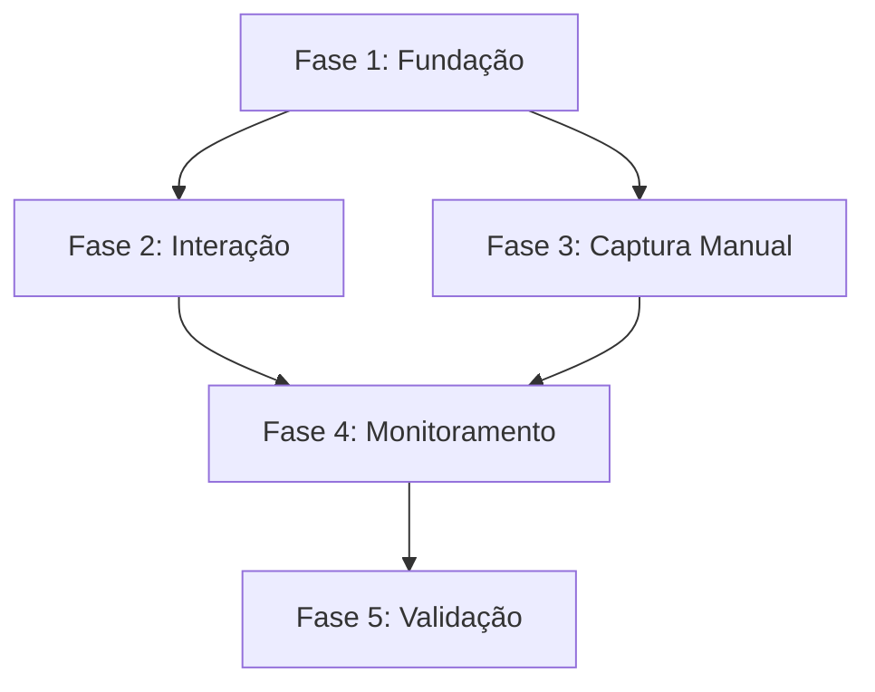

# Épico: Sistema de Reporte de Erros
**Documento de Planejamento Mestre**

---

## 📋 Visão Geral

### Objetivo
Criar um sistema abrangente de captura, tratamento e reporte de erros para garantir a qualidade e resiliência da aplicação de análise de documentos. O sistema deve:

- **Capturar** erros automaticamente em toda a aplicação
- **Informar** usuários de forma clara e útil sobre problemas
- **Reportar** erros para monitoramento e análise posterior
- **Centralizar** o tratamento de erros em uma arquitetura consistente

### Contexto Atual
A aplicação possui:
- ✅ Sistema básico de toast notifications (useToast)
- ✅ Tratamento try/catch em serviços específicos
- ✅ Logging básico no console
- ❌ Error boundaries ausentes
- ❌ Sistema centralizado de monitoramento
- ❌ Coleta estruturada de feedback do usuário

### Benefícios Esperados
- **Experiência do usuário:** Melhor comunicação de erros e recuperação
- **Qualidade:** Identificação proativa de problemas
- **Manutenibilidade:** Debugging facilitado e monitoramento centralizado
- **Produtividade:** Redução do tempo de resolução de bugs

---

## 🏗️ Fase 1: Fundação e Captura Automática

### Objetivos da Fase
Estabelecer a infraestrutura base para captura automática de erros React e criar componentes de fallback elegantes.

### Componentes a Criar

#### 1. `src/components/error/ErrorBoundary.tsx`
**Responsabilidades:**
- Capturar erros JavaScript não tratados em componentes React
- Registrar erros com contexto detalhado
- Renderizar componente de fallback
- Integrar com sistema de monitoramento

**Funcionalidades:**
```typescript
interface ErrorBoundaryState {
  hasError: boolean;
  error?: Error;
  errorInfo?: ErrorInfo;
  errorId: string;
}

interface ErrorBoundaryProps {
  fallback?: ComponentType<ErrorFallbackProps>;
  onError?: (error: Error, errorInfo: ErrorInfo) => void;
  children: ReactNode;
}
```

**Integração:**
- Hook para componentDidCatch e getDerivedStateFromError
- Geração de ID único para cada erro
- Coleta de contexto do usuário e aplicação
- Reset automático do estado após timeout

#### 2. `src/components/error/ErrorFallback.tsx`
**Responsabilidades:**
- Interface amigável para quando erros ocorrem
- Opções de recuperação para o usuário
- Coleta opcional de feedback do usuário

**Design:**
- Card centralizado com ícone de erro
- Mensagem explicativa não técnica
- Botões: "Tentar Novamente", "Reportar Problema", "Voltar ao Início"
- Design system integrado (semantic tokens)
- Responsivo e acessível

#### 3. Integração no `src/App.tsx`
**Modificações:**
```typescript
// Envolver toda a aplicação com ErrorBoundary
<ErrorBoundary fallback={ErrorFallback}>
  <QueryClientProvider client={queryClient}>
    // ... resto da aplicação
  </QueryClientProvider>
</ErrorBoundary>
```

### Estrutura de Arquivos
```
src/
├── components/
│   └── error/
│       ├── ErrorBoundary.tsx
│       ├── ErrorFallback.tsx
│       └── index.ts
├── types/
│   └── error.ts
└── utils/
    └── errorUtils.ts
```

### Critérios de Aceitação
- [ ] ErrorBoundary captura erros React automaticamente
- [ ] ErrorFallback renderiza interface amigável
- [ ] Integração no App.tsx funcional
- [ ] Logs estruturados gerados
- [ ] Testes unitários implementados

---

## 🎭 Fase 2: Interação e Reporte do Usuário

### Objetivos da Fase
Criar interface para coleta de feedback do usuário sobre erros e integrar com sistema de notificações existente.

### Componentes a Criar

#### 1. `src/components/error/ErrorReportDialog.tsx`
**Responsabilidades:**
- Modal para coleta de feedback detalhado
- Formulário estruturado de reporte
- Anexo de contexto técnico automático
- Integração com toast system

**Funcionalidades:**
```typescript
interface ErrorReportData {
  errorId: string;
  userDescription: string;
  userEmail?: string;
  reproducibleSteps?: string;
  userAgent: string;
  url: string;
  timestamp: Date;
  severity: 'low' | 'medium' | 'high' | 'critical';
}
```

**Design:**
- Dialog responsivo usando Radix UI
- Campos: descrição do problema, passos para reproduzir, email (opcional)
- Checkbox para incluir dados técnicos
- Seleção de severidade
- Preview dos dados técnicos coletados

#### 2. `src/hooks/useErrorReport.ts`
**Responsabilidades:**
- Gerenciar estado do formulário de reporte
- Validação de dados
- Submissão para serviço de monitoramento
- Feedback de sucesso/erro

#### 3. Integração com Sistema Existente
**Modificações:**
- Extender ErrorFallback com botão "Reportar Problema"
- Integrar com useToast para feedback
- Adicionar contexto de erro ao reporte

### Fluxo do Usuário
1. Erro ocorre → ErrorBoundary captura
2. ErrorFallback exibe opções
3. Usuário clica "Reportar Problema"
4. ErrorReportDialog abre com contexto pré-preenchido
5. Usuário preenche detalhes adicionais
6. Sistema submete reporte e exibe confirmação

### Critérios de Aceitação
- [ ] Modal de reporte funcional e acessível
- [ ] Formulário validado e estruturado
- [ ] Contexto técnico coletado automaticamente
- [ ] Integração com toast notifications
- [ ] UX fluida e intuitiva

---

## ⚙️ Fase 3: Captura Manual e Programática

### Objetivos da Fase
Criar ferramentas para captura manual de erros em código e padronizar tratamento em toda aplicação.

### Componentes a Criar

#### 1. `src/hooks/useErrorHandler.ts`
**Responsabilidades:**
- Hook customizado para tratamento programático
- Substituir console.error por sistema estruturado
- Wrapper para operações assíncronas
- Integração com contexto da aplicação

**API:**
```typescript
interface UseErrorHandlerReturn {
  logError: (error: Error, context?: ErrorContext) => string;
  handleAsyncError: <T>(
    asyncFn: () => Promise<T>,
    errorContext?: ErrorContext
  ) => Promise<T | null>;
  clearError: (errorId: string) => void;
  getErrorById: (errorId: string) => ErrorRecord | null;
}

interface ErrorContext {
  component?: string;
  action?: string;
  userId?: string;
  metadata?: Record<string, any>;
}
```

#### 2. `src/utils/errorClassification.ts`
**Responsabilidades:**
- Classificação automática de tipos de erro
- Mapeamento de severidade
- Categorização para relatórios

**Categorias:**
- Network errors (API, conectividade)
- Validation errors (dados inválidos)
- Authentication errors (sessão, permissões)
- Business logic errors (regras de negócio)
- UI errors (componentes, renderização)

#### 3. Refatoração dos Serviços Existentes
**Modificações necessárias:**
- `src/services/documentService.ts`
- `src/services/documentAnalysisService.ts`
- `src/pages/DocumentReview.tsx`

**Padrão de implementação:**
```typescript
// Antes
try {
  const result = await apiCall();
  return result;
} catch (error) {
  console.error('Error in service:', error);
  throw error;
}

// Depois
const { handleAsyncError } = useErrorHandler();

const result = await handleAsyncError(
  () => apiCall(),
  { component: 'DocumentService', action: 'uploadDocument' }
);
```

### Critérios de Aceitação
- [ ] Hook useErrorHandler implementado e testado
- [ ] Classificação automática de erros funcional
- [ ] Serviços existentes refatorados
- [ ] Padrão consistente em toda aplicação
- [ ] Documentação de uso criada

---

## 📊 Fase 4: Centralização e Monitoramento

### Objetivos da Fase
Centralizar coleta de erros e preparar infraestrutura para integração com serviços externos de monitoramento.

### Componentes a Criar

#### 1. `src/services/monitoringService.ts`
**Responsabilidades:**
- Centralizar todas as operações de monitoramento
- Abstração para diferentes provedores (Sentry, LogRocket, etc.)
- Buffering e batching de eventos
- Configuração por ambiente

**API:**
```typescript
interface MonitoringService {
  init(config: MonitoringConfig): void;
  logError(error: ErrorRecord): string;
  logEvent(event: AnalyticsEvent): void;
  setUserContext(user: UserContext): void;
  addBreadcrumb(breadcrumb: Breadcrumb): void;
  flush(): Promise<void>;
}

interface MonitoringConfig {
  environment: 'development' | 'staging' | 'production';
  enableLocalStorage: boolean;
  bufferSize: number;
  autoFlushInterval: number;
  providers: {
    sentry?: SentryConfig;
    custom?: CustomProviderConfig;
  };
}
```

#### 2. `src/components/error/ErrorDashboard.tsx` (Admin)
**Responsabilidades:**
- Dashboard interno para visualização de erros
- Filtros por período, tipo, severidade
- Estatísticas básicas
- Export de relatórios

#### 3. `src/hooks/useMonitoring.ts`
**Responsabilidades:**
- Hook para interação com monitoringService
- Context provider para configuração global
- Utilities para desenvolvedores

### Estratégia de Integração Futura

#### Sentry Integration
```typescript
// Configuração futura
const sentryConfig = {
  dsn: process.env.VITE_SENTRY_DSN,
  environment: process.env.NODE_ENV,
  beforeSend: (event) => {
    // Filtros customizados
    return event;
  }
};
```

#### Custom Analytics
- Preparação para Google Analytics
- Estrutura para métricas customizadas
- Integration points para Supabase

### Critérios de Aceitação
- [ ] MonitoringService centralizado implementado
- [ ] Dashboard básico funcional
- [ ] Hooks de monitoramento criados
- [ ] Configuração por ambiente
- [ ] Documentação de integração

---

## ✅ Fase 5: Validação e Documentação

### Objetivos da Fase
Garantir qualidade através de testes abrangentes e criar documentação completa para manutenção e evolução.

### Cenários de Teste

#### 1. Testes de Error Boundary
```typescript
// Cenários obrigatórios
describe('ErrorBoundary', () => {
  it('should catch and display fallback for component errors');
  it('should generate unique error IDs');
  it('should log errors with correct context');
  it('should reset state after timeout');
  it('should handle nested error boundaries');
});
```

#### 2. Testes de Integração
- Fluxo completo: erro → captura → exibição → reporte
- Integração com toast system
- Persistência de dados de erro
- Performance com múltiplos erros

#### 3. Testes de Usabilidade
- Acessibilidade do ErrorFallback
- Responsividade em diferentes dispositivos
- Fluxo do formulário de reporte
- Clareza das mensagens de erro

### Documentação Técnica

#### 1. `docs/error-handling/README.md`
- Visão geral do sistema
- Arquitetura e componentes
- Guia de troubleshooting

#### 2. `docs/error-handling/DEVELOPMENT_GUIDE.md`
- Como usar useErrorHandler
- Padrões de implementação
- Melhores práticas
- Exemplos de código

#### 3. `docs/error-handling/CONFIGURATION.md`
- Configuração de ambiente
- Integração com serviços externos
- Customização de comportamentos

#### 4. `docs/error-handling/TESTING.md`
- Estratégias de teste
- Mocks e utilities
- Casos de teste recomendados

### Métricas de Qualidade

#### Cobertura de Testes
- Mínimo 90% de cobertura de código
- 100% dos fluxos críticos testados
- Testes de regressão implementados

#### Performance
- Overhead máximo de 2ms por erro capturado
- Buffering eficiente de eventos
- Memory leaks verificados

#### Usabilidade
- Tempo médio de compreensão do erro < 30s
- Taxa de completude do formulário de reporte > 70%
- Acessibilidade WCAG AA compliance

### Critérios de Aceitação
- [ ] Suite de testes completa implementada
- [ ] Documentação técnica criada
- [ ] Métricas de qualidade atingidas
- [ ] Code review aprovado
- [ ] Deploy em staging validado

---

## 🚀 Implementação e Timeline

### Dependências Entre Fases


### Estimativas
- **Fase 1:** 2-3 dias (fundação crítica)
- **Fase 2:** 2 dias (interface do usuário)
- **Fase 3:** 3 dias (refatoração extensiva)
- **Fase 4:** 2-3 dias (infraestrutura)
- **Fase 5:** 2 dias (qualidade)

**Total estimado:** 11-13 dias de desenvolvimento

### Entregáveis por Fase
1. **Fase 1:** Sistema básico de error boundary funcional
2. **Fase 2:** Interface de reporte do usuário completa
3. **Fase 3:** Padronização em toda aplicação
4. **Fase 4:** Sistema de monitoramento centralizado
5. **Fase 5:** Sistema completo, testado e documentado

### Considerações Técnicas

#### Performance
- Lazy loading de componentes de erro
- Debouncing de eventos de erro
- Otimização de re-renders

#### Segurança
- Sanitização de dados do usuário
- Não exposição de informações sensíveis
- Validação de inputs

#### Escalabilidade
- Estrutura preparada para crescimento
- Configuração flexível
- Arquitetura extensível

---

## 📚 Conclusão

Este épico estabelece a fundação para um sistema robusto de tratamento de erros que:

1. **Melhora a experiência do usuário** com tratamento elegante de erros
2. **Facilita debugging** com contexto rico e centralizado
3. **Aumenta a qualidade** através de monitoramento proativo
4. **Prepara para escala** com arquitetura extensível

O sistema será implementado de forma incremental, garantindo que cada fase adicione valor imediato enquanto constrói a infraestrutura para as próximas funcionalidades.

**Próximos passos:** Aprovação do plano e início da Fase 1 - Fundação e Captura Automática.