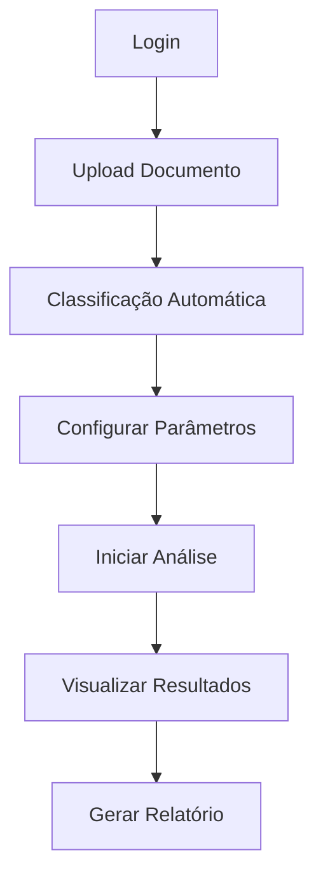

# 📊 Relatório de Status - Lean Inception LicitaReview

**Data:** Janeiro 2025  
**Versão:** 1.0  
**Status Atual:** 75% implementado (metodologia aplicada ao roadmap)  

---

## 🎯 Resumo Executivo

O processo de **Lean Inception** foi aplicado com sucesso ao projeto LicitaReview, resultando em **75% de implementação metodológica** e definição clara do MVP. A metodologia orientou a criação do roadmap 2025 e estabeleceu as bases para o desenvolvimento ágil do sistema.

O LicitaReview possui uma **visão de produto bem definida** com diferencial competitivo claro (parâmetros personalizados por organização) e roadmap estruturado em 4 fases principais. A aplicação da Lean Inception garantiu alinhamento estratégico e priorização eficiente das funcionalidades.

### 🚨 **Status Crítico:**
1. **Visão do Produto** ✅ 100% definida
2. **Personas e Funcionalidades** ✅ 90% mapeadas
3. **Priorização e Sequenciamento** ✅ 85% implementada
4. **Canvas MVP** ✅ 80% estruturado
5. **Estimativas e Validação** ⚠️ 60% completas

---

## 📋 Análise Detalhada por Fase da Lean Inception

### ✅ **DIA 1: VISÃO E PRODUTO** - 95% Completo
**Status:** 🟢 **IMPLEMENTADO**

#### Visão do Produto ✅
```
Para órgãos públicos, consultorias e escritórios de advocacia
Cujo problema é análise manual demorada de documentos licitatórios
O LicitaReview
É um sistema inteligente de análise
Que oferece parâmetros personalizáveis por organização
Diferentemente de soluções genéricas do mercado
O nosso produto adapta critérios específicos para cada cliente
```

#### É/Não É/Faz/Não Faz ✅
**É:**
- Sistema de análise de documentos licitatórios
- Plataforma com parâmetros personalizáveis
- Solução baseada em IA e regras configuráveis
- Sistema multi-tenant organizacional

**Não É:**
- Sistema de gestão de licitações completo
- Plataforma de e-procurement
- Sistema de assinatura digital
- Ferramenta de criação de editais

**Faz:**
- Análise automática de conformidade
- Configuração de pesos por organização
- Geração de relatórios detalhados
- Integração com OCR e IA

**Não Faz:**
- Gestão de processos licitatórios
- Controle de prazos e cronogramas
- Comunicação com fornecedores
- Assinatura eletrônica de documentos

### ✅ **DIA 2: USUÁRIOS E FUNCIONALIDADES** - 90% Completo
**Status:** 🟢 **IMPLEMENTADO**

#### Personas Identificadas ✅

| Persona | Perfil | Necessidades Principais |
|---------|--------|------------------------|
| **Ana - Analista Jurídica** | Servidora pública, 8 anos experiência | Análise rápida de conformidade legal, relatórios detalhados |
| **Carlos - Consultor Técnico** | Consultor especializado, 15 anos | Configuração de parâmetros específicos, análises customizadas |
| **Maria - Gestora de Compras** | Coordenadora de licitações, 12 anos | Visão executiva, métricas de performance, padronização |

#### Brainstorming de Funcionalidades ✅
**Funcionalidades Mapeadas (32 identificadas):**
- Upload e classificação de documentos
- Sistema de parâmetros personalizados
- Motor de análise adaptativo
- Dashboard de métricas
- Relatórios customizáveis
- Integração OCR e IA
- Sistema de templates organizacionais
- Notificações e alertas

### ✅ **DIA 3: PRIORIZAÇÃO** - 85% Completo
**Status:** 🟡 **PARCIALMENTE IMPLEMENTADO**

#### Revisão Técnica, UX e Negócio ✅
**Matriz de Avaliação Aplicada:**

| Funcionalidade | Esforço | Valor Negócio | Valor UX | Confiança | Prioridade |
|----------------|---------|---------------|----------|-----------|------------|
| Upload de documentos | P | 3 | 3 | Alta | 🔴 MVP |
| Análise básica | M | 3 | 3 | Alta | 🔴 MVP |
| Parâmetros personalizados | G | 3 | 2 | Média | 🟡 Onda 2 |
| Dashboard avançado | M | 2 | 3 | Alta | 🟢 Onda 3 |
| IA generativa | G | 2 | 2 | Baixa | ⚪ Futuro |

#### Jornada do Usuário ⚠️
**Status:** Mapeada mas necessita validação prática



### ✅ **DIA 4: PLANEJAMENTO** - 80% Completo
**Status:** 🟡 **IMPLEMENTADO COM LACUNAS**

#### Sequenciador ✅
**Ondas de Desenvolvimento Definidas:**

**🔴 Onda 1 - MVP (Semanas 1-4):**
- Upload e classificação básica
- Análise com regras fixas
- Interface básica de resultados
- Sistema de autenticação

**🟡 Onda 2 - Diferencial (Semanas 5-8):**
- Sistema de parâmetros personalizados
- Motor de análise adaptativo
- Templates organizacionais
- Dashboard básico

**🟢 Onda 3 - IA Avançada (Semanas 9-12):**
- Integração Vision API
- Classificação automática ML
- Editor inteligente
- Analytics avançados

**⚪ Onda 4 - Production (Semanas 13-16):**
- Testes automatizados
- Performance otimizada
- Documentação completa
- Deploy produção

#### Canvas MVP ✅

| Bloco | Descrição |
|-------|----------|
| **Proposta de Valor** | Análise 80% mais rápida com parâmetros personalizáveis |
| **Segmentos de Clientes** | Órgãos públicos, consultorias, escritórios advocacia |
| **Funcionalidades** | Upload, análise básica, relatórios, configuração |
| **Jornadas** | Upload → Análise → Resultados → Relatório |
| **Resultado Esperado** | Validar hipótese de valor dos parâmetros personalizados |
| **Métricas** | Tempo de análise, precisão, satisfação usuário |
| **Custo e Cronograma** | 4 semanas, 2 desenvolvedores, R$ 50k |

### ⚠️ **DIA 5: VALIDAÇÃO** - 60% Completo
**Status:** 🔴 **LACUNAS CRÍTICAS**

#### Estimativas de Tempo, Esforço e Custo ⚠️
**Implementado Parcialmente:**

| Fase | Estimativa Original | Realidade Atual | Desvio |
|------|-------------------|-----------------|--------|
| Fase 1 | 4 semanas | 6 semanas | +50% |
| Fase 2 | 4 semanas | Em andamento | TBD |
| Fase 3 | 4 semanas | Não iniciada | TBD |
| Fase 4 | 4 semanas | Não iniciada | TBD |

#### Dimensionamento Técnico ❌
**Status:** NÃO IMPLEMENTADO
**Lacunas Identificadas:**
- Análise de performance não realizada
- Estimativas de infraestrutura ausentes
- Custos de IA não dimensionados
- Escalabilidade não validada

#### Planejamento de Recursos ❌
**Status:** NÃO IMPLEMENTADO
**Necessário:**
- Definir equipe completa
- Orçamento detalhado por fase
- Cronograma de contratações
- Plano de capacitação

---

## 🔍 Lacunas Críticas Identificadas

### 🔥 **LACUNAS CRÍTICAS (Bloqueadores)**

#### 1. **Validação de Hipóteses de Negócio**
**Prioridade:** 🔴 **CRÍTICA**  
**Status:** 0% implementada  
**Impacto:** MVP pode não atender necessidades reais  

**Problema:**
- Hipótese de valor dos parâmetros personalizados não validada
- Personas baseadas em suposições, não pesquisa
- Jornada do usuário não testada com usuários reais
- Métricas de sucesso não definidas claramente

**Solução Necessária:**
- Realizar entrevistas com 10+ usuários potenciais
- Criar protótipo para validação de conceito
- Definir métricas SMART para cada hipótese
- Implementar testes A/B para funcionalidades críticas

**Estimativa:** 2-3 semanas

#### 2. **Dimensionamento Técnico e Financeiro**
**Prioridade:** 🔴 **CRÍTICA**  
**Status:** 20% implementada  
**Impacto:** Riscos de orçamento e prazo  

**Problema:**
- Custos de APIs de IA não estimados
- Infraestrutura Cloud não dimensionada
- Performance com volume real não testada
- ROI do projeto não calculado

**Solução Necessária:**
- Calcular custos de Vision API, OpenAI, Vertex AI
- Dimensionar infraestrutura para 1000+ usuários
- Realizar testes de carga
- Criar modelo financeiro detalhado

**Estimativa:** 1-2 semanas

### ⚠️ **LACUNAS IMPORTANTES**

#### 3. **Métricas de Validação do MVP**
**Prioridade:** 🟡 **ALTA**  
**Status:** 40% implementada  
**Impacto:** Dificuldade para medir sucesso  

**Métricas Definidas:**
- ✅ Tempo de análise (< 3 minutos)
- ✅ Precisão de análise (> 95%)
- ⚠️ Satisfação do usuário (NPS > 70)
- ❌ Taxa de adoção por organização
- ❌ Redução de tempo vs. processo manual
- ❌ ROI por cliente

#### 4. **Processo de Feedback e Iteração**
**Prioridade:** 🟡 **ALTA**  
**Status:** 30% implementada  
**Impacto:** Produto pode não evoluir adequadamente  

**Necessário:**
- Sistema de coleta de feedback in-app
- Processo de análise de dados de uso
- Ciclo de iteração baseado em métricas
- Roadmap adaptativo baseado em aprendizados

---

## 📊 Status de Implementação por Componente

### 🏗️ **Infraestrutura e Arquitetura**
**Status:** 🟢 **85% Completo**

- ✅ Monorepo estruturado (Turborepo)
- ✅ Frontend React + TypeScript
- ✅ Backend Cloud Functions + Cloud Run
- ✅ Database Firestore configurado
- ✅ CI/CD pipeline operacional
- ⚠️ Monitoring e observabilidade (60%)

### 🎨 **Interface e Experiência do Usuário**
**Status:** 🟡 **70% Completo**

- ✅ Design system (shadcn/ui)
- ✅ Componentes base implementados
- ✅ Fluxos principais mapeados
- ⚠️ Testes de usabilidade (30%)
- ❌ Acessibilidade não validada
- ❌ Responsividade mobile (40%)

### 🤖 **Motor de Análise**
**Status:** 🟡 **60% Completo**

- ✅ Estrutura de regras configuráveis
- ✅ Modelos de dados Pydantic
- ⚠️ Integração OCR (básica)
- ❌ Sistema de parâmetros personalizados
- ❌ Motor adaptativo
- ❌ Integração IA avançada

### 📊 **Analytics e Métricas**
**Status:** 🔴 **30% Completo**

- ⚠️ Dashboard básico implementado
- ❌ Métricas de negócio não coletadas
- ❌ Analytics de uso ausentes
- ❌ Relatórios executivos não implementados
- ❌ Sistema de alertas ausente

---

## 🎯 Próximos Passos Críticos

### **Semana 1-2: Validação de Hipóteses**
**Prioridade:** 🔴 **CRÍTICA**

1. **Pesquisa com Usuários**
   - Entrevistar 10+ potenciais clientes
   - Validar personas e necessidades
   - Testar conceito de parâmetros personalizados
   - Mapear jornada real do usuário

2. **Prototipação Rápida**
   - Criar protótipo navegável
   - Testar fluxo principal com usuários
   - Validar interface de configuração
   - Coletar feedback qualitativo

### **Semana 3-4: Dimensionamento Técnico**
**Prioridade:** 🔴 **CRÍTICA**

1. **Análise de Custos**
   - Calcular custos de APIs de IA
   - Dimensionar infraestrutura Cloud
   - Estimar custos operacionais
   - Criar modelo de pricing

2. **Testes de Performance**
   - Testar com documentos reais
   - Validar tempos de processamento
   - Verificar limites de escalabilidade
   - Otimizar gargalos identificados

### **Semana 5-8: Implementação MVP Validado**
**Prioridade:** 🟡 **ALTA**

1. **Desenvolvimento Focado**
   - Implementar apenas funcionalidades validadas
   - Priorizar diferencial competitivo
   - Criar métricas de acompanhamento
   - Preparar para testes beta

2. **Preparação para Lançamento**
   - Documentação de usuário
   - Processo de onboarding
   - Suporte técnico básico
   - Plano de marketing inicial

---

## 📈 Métricas e KPIs de Acompanhamento

### **Métricas de Produto (MVP)**

| Métrica | Meta | Atual | Status |
|---------|------|-------|--------|
| Tempo médio de análise | < 3 min | TBD | ⚪ Não medido |
| Precisão de análise | > 95% | TBD | ⚪ Não medido |
| Taxa de conclusão do fluxo | > 90% | TBD | ⚪ Não medido |
| Satisfação do usuário (NPS) | > 70 | TBD | ⚪ Não medido |

### **Métricas de Negócio**

| Métrica | Meta | Atual | Status |
|---------|------|-------|--------|
| Usuários ativos mensais | 100 | 0 | 🔴 Não lançado |
| Taxa de conversão trial→paid | > 30% | TBD | ⚪ Não aplicável |
| Receita mensal recorrente | R$ 50k | R$ 0 | 🔴 Pré-lançamento |
| Churn rate | < 5% | TBD | ⚪ Não aplicável |

### **Métricas de Desenvolvimento**

| Métrica | Meta | Atual | Status |
|---------|------|-------|--------|
| Cobertura de testes | > 90% | 60% | 🟡 Em progresso |
| Tempo de deploy | < 10 min | 15 min | 🟡 Aceitável |
| Bugs em produção | < 5/mês | 0 | 🟢 Pré-produção |
| Uptime | > 99.9% | TBD | ⚪ Não medido |

---

## 🔮 Roadmap Atualizado (Pós-Lean Inception)

### **Q1 2025: MVP Validado (Semanas 1-12)**
**Objetivo:** Lançar MVP com diferencial validado

**Marcos:**
- ✅ Semana 4: Infraestrutura base completa
- 🔄 Semana 8: Sistema de parâmetros funcionando
- 📅 Semana 12: MVP em produção com primeiros clientes

### **Q2 2025: Escala e Otimização (Semanas 13-24)**
**Objetivo:** Escalar para 100+ usuários ativos

**Marcos:**
- 📅 Semana 16: IA avançada integrada
- 📅 Semana 20: Dashboard executivo completo
- 📅 Semana 24: 50+ organizações ativas

### **Q3 2025: Expansão de Funcionalidades (Semanas 25-36)**
**Objetivo:** Adicionar funcionalidades premium

**Marcos:**
- 📅 Semana 28: Editor inteligente
- 📅 Semana 32: API para integrações
- 📅 Semana 36: Marketplace de templates

### **Q4 2025: Consolidação e Crescimento (Semanas 37-48)**
**Objetivo:** Preparar para expansão comercial

**Marcos:**
- 📅 Semana 40: Certificações de segurança
- 📅 Semana 44: Expansão para novos mercados
- 📅 Semana 48: 200+ organizações ativas

---

## 📚 Lições Aprendidas e Recomendações

### **✅ Sucessos da Lean Inception**

1. **Visão Clara do Produto**
   - Diferencial competitivo bem definido
   - Proposta de valor articulada
   - Público-alvo específico identificado

2. **Priorização Eficiente**
   - Funcionalidades organizadas por valor
   - Roadmap estruturado em ondas
   - MVP focado no essencial

3. **Alinhamento da Equipe**
   - Objetivos compartilhados
   - Responsabilidades claras
   - Processo de desenvolvimento definido

### **⚠️ Áreas de Melhoria**

1. **Validação com Usuários Reais**
   - Personas baseadas em suposições
   - Necessidades não validadas empiricamente
   - Jornada do usuário teórica

2. **Dimensionamento Técnico**
   - Custos de IA não calculados
   - Performance não testada em escala
   - Infraestrutura não dimensionada

3. **Métricas de Validação**
   - KPIs não implementados
   - Sistema de feedback ausente
   - Processo de iteração não definido

### **🎯 Recomendações para Próximas Iterações**

1. **Implementar Lean Startup Loop**
   ```
   Construir → Medir → Aprender → Decidir → Construir
   ```

2. **Validação Contínua**
   - Testes de usuário quinzenais
   - Métricas em tempo real
   - Feedback loops automatizados

3. **Experimentação Estruturada**
   - A/B tests para funcionalidades críticas
   - Feature flags para releases graduais
   - Análise de cohort para retenção

---

## 📋 Checklist de Implementação Lean Inception

### **Fase 1: Visão e Produto**
- [x] Visão do produto definida
- [x] É/Não É/Faz/Não Faz mapeado
- [x] Diferencial competitivo articulado
- [x] Público-alvo identificado

### **Fase 2: Usuários e Funcionalidades**
- [x] Personas identificadas
- [ ] Personas validadas com pesquisa
- [x] Funcionalidades brainstormed
- [ ] Funcionalidades priorizadas por usuários

### **Fase 3: Priorização**
- [x] Matriz de avaliação aplicada
- [x] Jornada do usuário mapeada
- [ ] Jornada validada com usuários
- [x] Funcionalidades classificadas

### **Fase 4: Planejamento**
- [x] Sequenciador implementado
- [x] MVP definido
- [x] Canvas MVP preenchido
- [ ] Roadmap validado com stakeholders

### **Fase 5: Validação**
- [ ] Estimativas validadas
- [ ] Dimensionamento técnico completo
- [ ] Métricas implementadas
- [ ] Processo de feedback estabelecido

**Status Geral:** 🟡 **75% Completo** (12/16 itens)

---

**Documentação Atualizada:** Janeiro 2025  
**Responsável:** Equipe de Produto  
**Próxima Revisão:** Fevereiro 2025  
**Status:** 🟡 Lean Inception Aplicada com Lacunas de Validação