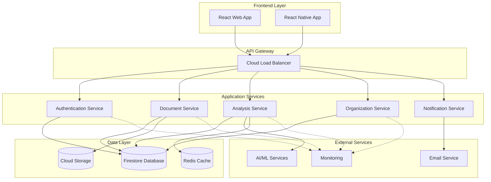

# Arquitetura Técnica Detalhada - LicitaReview

## 1. Visão Geral da Arquitetura

### 1.1 Princípios Arquiteturais

**Clean Architecture + Domain-Driven Design**
- Separação clara entre camadas de domínio, aplicação, infraestrutura e apresentação
- Inversão de dependências para facilitar testes e manutenção
- Bounded contexts bem definidos para cada área de negócio

**Microservices Pattern**
- Serviços independentes e especializados
- Comunicação via APIs REST e eventos
- Escalabilidade horizontal por serviço

### 1.2 Diagrama de Arquitetura Geral



## 2. Especificações Técnicas por Camada

### 2.1 Frontend Architecture

#### **2.1.1 Tecnologias Core**
```typescript
// Dependências principais
const frontendStack = {
  framework: 'React 18.2+',
  bundler: 'Vite 4.0+',
  language: 'TypeScript 5.0+',
  styling: 'Tailwind CSS 3.3+',
  stateManagement: 'Zustand 4.0+',
  routing: 'React Router 6.8+',
  forms: 'React Hook Form 7.43+',
  queries: 'TanStack Query 4.0+',
  testing: 'Vitest + Testing Library',
  linting: 'ESLint + Prettier',
  typeChecking: 'TypeScript strict mode'
};
```

#### **2.1.2 Estrutura de Pastas Detalhada**
```
apps/web/src/
├── app/                           # Configuração da aplicação
│   ├── providers/                 # Context providers
│   │   ├── QueryProvider.tsx
│   │   ├── ThemeProvider.tsx
│   │   └── AuthProvider.tsx
│   ├── router/                    # Configuração de rotas
│   │   ├── AppRouter.tsx
│   │   ├── ProtectedRoute.tsx
│   │   └── LazyRoutes.tsx
│   ├── store/                     # Estado global
│   │   ├── authStore.ts
│   │   ├── uiStore.ts
│   │   └── index.ts
│   └── App.tsx
├── shared/                        # Código compartilhado
│   ├── components/                # Componentes reutilizáveis
│   │   ├── ui/                    # Componentes base
│   │   │   ├── Button/
│   │   │   │   ├── Button.tsx
│   │   │   │   ├── Button.test.tsx
│   │   │   │   ├── Button.stories.tsx
│   │   │   │   └── index.ts
│   │   │   ├── Input/
│   │   │   ├── Card/
│   │   │   └── Modal/
│   │   ├── layout/                # Componentes de layout
│   │   │   ├── Header/
│   │   │   ├── Sidebar/
│   │   │   ├── Footer/
│   │   │   └── PageLayout/
│   │   └── feedback/              # Componentes de feedback
│   │       ├── Toast/
│   │       ├── LoadingSpinner/
│   │       └── ErrorBoundary/
│   ├── hooks/                     # Hooks customizados
│   │   ├── useApi.ts
│   │   ├── useAuth.ts
│   │   ├── useLocalStorage.ts
│   │   ├── useDebounce.ts
│   │   └── usePerformance.ts
│   ├── services/                  # Serviços de infraestrutura
│   │   ├── api/
│   │   │   ├── client.ts
│   │   │   ├── endpoints.ts
│   │   │   └── interceptors.ts
│   │   ├── auth/
│   │   │   ├── authService.ts
│   │   │   └── tokenManager.ts
│   │   └── storage/
│   │       ├── localStorage.ts
│   │       └── sessionStorage.ts
│   ├── utils/                     # Utilitários
│   │   ├── formatters.ts
│   │   ├── validators.ts
│   │   ├── constants.ts
│   │   └── helpers.ts
│   ├── types/                     # Tipos compartilhados
│   │   ├── api.ts
│   │   ├── auth.ts
│   │   ├── common.ts
│   │   └── index.ts
│   └── styles/                    # Estilos globais
│       ├── globals.css
│       ├── components.css
│       └── utilities.css
├── features/                      # Features por domínio
│   ├── analysis/
│   │   ├── components/
│   │   │   ├── AnalysisCard/
│   │   │   ├── AnalysisForm/
│   │   │   ├── AnalysisResults/
│   │   │   └── AnalysisMetrics/
│   │   ├── hooks/
│   │   │   ├── useAnalysis.ts
│   │   │   ├── useAnalysisActions.ts
│   │   │   └── useAnalysisFilters.ts
│   │   ├── services/
│   │   │   ├── analysisApi.ts
│   │   │   └── analysisCache.ts
│   │   ├── types/
│   │   │   ├── analysis.ts
│   │   │   └── parameters.ts
│   │   ├── utils/
│   │   │   ├── analysisHelpers.ts
│   │   │   └── analysisValidators.ts
│   │   └── pages/
│   │       ├── AnalysisListPage.tsx
│   │       ├── AnalysisDetailPage.tsx
│   │       └── CreateAnalysisPage.tsx
│   ├── documents/
│   ├── organizations/
│   └── users/
└── pages/                         # Páginas principais
    ├── HomePage.tsx
    ├── LoginPage.tsx
    ├── DashboardPage.tsx
    └── NotFoundPage.tsx
```

#### **2.1.3 Padrões de Componentes**

**Compound Components Pattern**
```typescript
// shared/components/ui/Card/Card.tsx
interface CardProps {
  children: React.ReactNode;
  className?: string;
  variant?: 'default' | 'outlined' | 'elevated';
}

interface CardHeaderProps {
  children: React.ReactNode;
  className?: string;
}

interface CardContentProps {
  children: React.ReactNode;
  className?: string;
}

interface CardFooterProps {
  children: React.ReactNode;
  className?: string;
  actions?: 'start' | 'end' | 'between';
}

const CardRoot = ({ children, className, variant = 'default' }: CardProps) => {
  const baseClasses = 'rounded-lg border bg-card text-card-foreground shadow-sm';
  const variantClasses = {
    default: 'border-border',
    outlined: 'border-2 border-primary',
    elevated: 'shadow-lg border-0'
  };
  
  return (
    <div className={cn(baseClasses, variantClasses[variant], className)}>
      {children}
    </div>
  );
};

const CardHeader = ({ children, className }: CardHeaderProps) => (
  <div className={cn('flex flex-col space-y-1.5 p-6', className)}>
    {children}
  </div>
);

const CardTitle = ({ children, className }: { children: React.ReactNode; className?: string }) => (
  <h3 className={cn('text-2xl font-semibold leading-none tracking-tight', className)}>
    {children}
  </h3>
);

const CardDescription = ({ children, className }: { children: React.ReactNode; className?: string }) => (
  <p className={cn('text-sm text-muted-foreground', className)}>
    {children}
  </p>
);

const CardContent = ({ children, className }: CardContentProps) => (
  <div className={cn('p-6 pt-0', className)}>
    {children}
  </div>
);

const CardFooter = ({ children, className, actions = 'end' }: CardFooterProps) => {
  const actionClasses = {
    start: 'justify-start',
    end: 'justify-end',
    between: 'justify-between'
  };
  
  return (
    <div className={cn('flex items-center p-6 pt-0', actionClasses[actions], className)}>
      {children}
    </div>
  );
};

// Compound component export
export const Card = Object.assign(CardRoot, {
  Header: CardHeader,
  Title: CardTitle,
  Description: CardDescription,
  Content: CardContent,
  Footer: CardFooter
});

// Uso do componente
<Card variant="elevated">
  <Card.Header>
    <Card.Title>Análise de Edital</Card.Title>
    <Card.Description>Documento: edital-001.pdf</Card.Description>
  </Card.Header>
  <Card.Content>
    <AnalysisMetrics data={metrics} />
  </Card.Content>
  <Card.Footer actions="between">
    <Button variant="outline">Cancelar</Button>
    <Button variant="primary">Baixar Relatório</Button>
  </Card.Footer>
</Card>
```

**Custom Hooks Pattern**
```typescript
// shared/hooks/useApi.ts
interface UseApiOptions<T> {
  enabled?: boolean;
  refetchOnWindowFocus?: boolean;
  staleTime?: number;
  cacheTime?: number;
  onSuccess?: (data: T) => void;
  onError?: (error: Error) => void;
}

export const useApi = <T>(
  endpoint: string,
  options: UseApiOptions<T> = {}
) => {
  const {
    enabled = true,
    refetchOnWindowFocus = false,
    staleTime = 5 * 60 * 1000, // 5 minutos
    cacheTime = 10 * 60 * 1000, // 10 minutos
    onSuccess,
    onError
  } = options;

  return useQuery({
    queryKey: [endpoint],
    queryFn: async (): Promise<T> => {
      const response = await apiClient.get<T>(endpoint);
      return response.data;
    },
    enabled,
    refetchOnWindowFocus,
    staleTime,
    cacheTime,
    onSuccess,
    onError
  });
};

// features/analysis/hooks/useAnalysis.ts
export const useAnalysis = (id: string) => {
  const { data, isLoading, error, refetch } = useApi<Analysis>(
    `/api/analysis/${id}`,
    {
      enabled: !!id,
      staleTime: 2 * 60 * 1000, // 2 minutos para dados mais dinâmicos
      onError: (error) => {
        console.error('Erro ao carregar análise:', error);
      }
    }
  );

  const updateAnalysis = useMutation({
    mutationFn: async (updates: Partial<Analysis>) => {
      const response = await apiClient.patch<Analysis>(`/api/analysis/${id}`, updates);
      return response.data;
    },
    onSuccess: () => {
      refetch();
    }
  });

  return {
    analysis: data,
    isLoading,
    error,
    updateAnalysis: updateAnalysis.mutate,
    isUpdating: updateAnalysis.isLoading,
    refetch
  };
};
```

### 2.2 Backend Architecture

#### **2.2.1 Clean Architecture Implementation**

**Domain Layer**
```typescript
// services/api/src/domain/entities/Analysis.ts
export class Analysis {
  private constructor(
    private readonly id: AnalysisId,
    private readonly documentId: DocumentId,
    private readonly organizationId: OrganizationId,
    private readonly parameters: AnalysisParameters,
    private status: AnalysisStatus,
    private results: AnalysisResult[],
    private readonly createdAt: Date,
    private updatedAt: Date
  ) {}

  public static create(
    documentId: DocumentId,
    organizationId: OrganizationId,
    parameters: AnalysisParameters
  ): Analysis {
    return new Analysis(
      AnalysisId.generate(),
      documentId,
      organizationId,
      parameters,
      AnalysisStatus.PENDING,
      [],
      new Date(),
      new Date()
    );
  }

  public static fromPersistence(data: AnalysisData): Analysis {
    return new Analysis(
      new AnalysisId(data.id),
      new DocumentId(data.documentId),
      new OrganizationId(data.organizationId),
      AnalysisParameters.fromData(data.parameters),
      AnalysisStatus.fromString(data.status),
      data.results.map(r => AnalysisResult.fromData(r)),
      new Date(data.createdAt),
      new Date(data.updatedAt)
    );
  }

  public process(processor: AnalysisProcessor): void {
    if (!this.canBeProcessed()) {
      throw new InvalidAnalysisStateError(
        `Analysis ${this.id.toString()} cannot be processed in status ${this.status.toString()}`
      );
    }

    this.status = AnalysisStatus.PROCESSING;
    this.updatedAt = new Date();

    try {
      this.results = processor.analyze(this.parameters);
      this.status = AnalysisStatus.COMPLETED;
    } catch (error) {
      this.status = AnalysisStatus.FAILED;
      throw new AnalysisProcessingError(
        `Failed to process analysis ${this.id.toString()}`,
        error
      );
    } finally {
      this.updatedAt = new Date();
    }
  }

  public addResult(result: AnalysisResult): void {
    this.results.push(result);
    this.updatedAt = new Date();
  }

  public canBeProcessed(): boolean {
    return this.status.equals(AnalysisStatus.PENDING) || 
           this.status.equals(AnalysisStatus.FAILED);
  }

  public isCompleted(): boolean {
    return this.status.equals(AnalysisStatus.COMPLETED);
  }

  public toPersistence(): AnalysisData {
    return {
      id: this.id.toString(),
      documentId: this.documentId.toString(),
      organizationId: this.organizationId.toString(),
      parameters: this.parameters.toData(),
      status: this.status.toString(),
      results: this.results.map(r => r.toData()),
      createdAt: this.createdAt.toISOString(),
      updatedAt: this.updatedAt.toISOString()
    };
  }

  // Getters
  public getId(): AnalysisId { return this.id; }
  public getDocumentId(): DocumentId { return this.documentId; }
  public getOrganizationId(): OrganizationId { return this.organizationId; }
  public getParameters(): AnalysisParameters { return this.parameters; }
  public getStatus(): AnalysisStatus { return this.status; }
  public getResults(): AnalysisResult[] { return [...this.results]; }
  public getCreatedAt(): Date { return this.createdAt; }
  public getUpdatedAt(): Date { return this.updatedAt; }
}

// services/api/src/domain/value-objects/AnalysisId.ts
export class AnalysisId {
  private constructor(private readonly value: string) {
    if (!this.isValid(value)) {
      throw new InvalidAnalysisIdError(`Invalid analysis ID: ${value}`);
    }
  }

  public static generate(): AnalysisId {
    return new AnalysisId(`analysis_${crypto.randomUUID()}`);
  }

  public static fromString(value: string): AnalysisId {
    return new AnalysisId(value);
  }

  private isValid(value: string): boolean {
    return /^analysis_[a-f0-9]{8}-[a-f0-9]{4}-[a-f0-9]{4}-[a-f0-9]{4}-[a-f0-9]{12}$/.test(value);
  }

  public toString(): string {
    return this.value;
  }

  public equals(other: AnalysisId): boolean {
    return this.value === other.value;
  }
}

// services/api/src/domain/repositories/AnalysisRepository.ts
export interface AnalysisRepository {
  findById(id: AnalysisId): Promise<Analysis | null>;
  findByOrganization(
    organizationId: OrganizationId,
    filters?: AnalysisFilters
  ): Promise<Analysis[]>;
  findByDocument(documentId: DocumentId): Promise<Analysis[]>;
  save(analysis: Analysis): Promise<void>;
  delete(id: AnalysisId): Promise<void>;
  count(filters?: AnalysisFilters): Promise<number>;
}
```

**Application Layer**
```typescript
// services/api/src/application/use-cases/ProcessAnalysisUseCase.ts
export class ProcessAnalysisUseCase {
  constructor(
    private readonly analysisRepository: AnalysisRepository,
    private readonly documentRepository: DocumentRepository,
    private readonly analysisProcessor: AnalysisProcessor,
    private readonly eventPublisher: EventPublisher,
    private readonly logger: Logger
  ) {}

  public async execute(request: ProcessAnalysisRequest): Promise<ProcessAnalysisResponse> {
    this.logger.info('Starting analysis processing', {
      documentId: request.documentId,
      organizationId: request.organizationId
    });

    // Validar se o documento existe
    const document = await this.documentRepository.findById(
      DocumentId.fromString(request.documentId)
    );
    
    if (!document) {
      throw new DocumentNotFoundError(request.documentId);
    }

    // Verificar permissões
    if (!document.belongsToOrganization(OrganizationId.fromString(request.organizationId))) {
      throw new UnauthorizedAccessError(
        `Organization ${request.organizationId} cannot access document ${request.documentId}`
      );
    }

    // Criar análise
    const analysis = Analysis.create(
      DocumentId.fromString(request.documentId),
      OrganizationId.fromString(request.organizationId),
      AnalysisParameters.fromRequest(request.parameters)
    );

    // Salvar análise
    await this.analysisRepository.save(analysis);

    // Publicar evento de análise criada
    await this.eventPublisher.publish(
      new AnalysisCreatedEvent(analysis.getId(), analysis.getDocumentId())
    );

    // Processar análise de forma assíncrona
    this.processAsync(analysis).catch(error => {
      this.logger.error('Failed to process analysis', {
        analysisId: analysis.getId().toString(),
        error: error.message
      });
    });

    this.logger.info('Analysis processing initiated', {
      analysisId: analysis.getId().toString()
    });

    return new ProcessAnalysisResponse(
      analysis.getId().toString(),
      analysis.getStatus().toString()
    );
  }

  private async processAsync(analysis: Analysis): Promise<void> {
    try {
      analysis.process(this.analysisProcessor);
      await this.analysisRepository.save(analysis);
      
      await this.eventPublisher.publish(
        new AnalysisCompletedEvent(
          analysis.getId(),
          analysis.getResults().length
        )
      );
    } catch (error) {
      await this.analysisRepository.save(analysis);
      
      await this.eventPublisher.publish(
        new AnalysisFailedEvent(
          analysis.getId(),
          error.message
        )
      );
      
      throw error;
    }
  }
}

// services/api/src/application/dto/ProcessAnalysisRequest.ts
export class ProcessAnalysisRequest {
  constructor(
    public readonly documentId: string,
    public readonly organizationId: string,
    public readonly parameters: AnalysisParametersDto
  ) {}

  public static fromHttp(body: any): ProcessAnalysisRequest {
    const validator = new ProcessAnalysisRequestValidator();
    const validatedData = validator.validate(body);
    
    return new ProcessAnalysisRequest(
      validatedData.documentId,
      validatedData.organizationId,
      validatedData.parameters
    );
  }
}

export class ProcessAnalysisResponse {
  constructor(
    public readonly analysisId: string,
    public readonly status: string
  ) {}

  public toHttp(): any {
    return {
      analysisId: this.analysisId,
      status: this.status,
      message: 'Analysis processing initiated successfully'
    };
  }
}
```

**Infrastructure Layer**
```typescript
// services/api/src/infrastructure/repositories/FirestoreAnalysisRepository.ts
export class FirestoreAnalysisRepository implements AnalysisRepository {
  private readonly collection = 'analyses';
  private readonly cache: Map<string, Analysis> = new Map();
  private readonly cacheTTL = 5 * 60 * 1000; // 5 minutos

  constructor(
    private readonly firestore: Firestore,
    private readonly logger: Logger
  ) {}

  public async findById(id: AnalysisId): Promise<Analysis | null> {
    const cacheKey = id.toString();
    
    // Verificar cache primeiro
    if (this.cache.has(cacheKey)) {
      this.logger.debug('Analysis found in cache', { analysisId: cacheKey });
      return this.cache.get(cacheKey)!;
    }

    try {
      const doc = await this.firestore
        .collection(this.collection)
        .doc(cacheKey)
        .get();

      if (!doc.exists) {
        this.logger.debug('Analysis not found', { analysisId: cacheKey });
        return null;
      }

      const analysis = Analysis.fromPersistence(doc.data() as AnalysisData);
      
      // Adicionar ao cache
      this.cache.set(cacheKey, analysis);
      setTimeout(() => this.cache.delete(cacheKey), this.cacheTTL);
      
      this.logger.debug('Analysis loaded from database', { analysisId: cacheKey });
      return analysis;
    } catch (error) {
      this.logger.error('Failed to find analysis by ID', {
        analysisId: cacheKey,
        error: error.message
      });
      throw new RepositoryError(`Failed to find analysis ${cacheKey}`, error);
    }
  }

  public async findByOrganization(
    organizationId: OrganizationId,
    filters?: AnalysisFilters
  ): Promise<Analysis[]> {
    try {
      let query = this.firestore
        .collection(this.collection)
        .where('organizationId', '==', organizationId.toString())
        .orderBy('createdAt', 'desc');

      if (filters) {
        query = this.applyFilters(query, filters);
      }

      const snapshot = await query.get();
      const analyses = snapshot.docs.map(doc => 
        Analysis.fromPersistence(doc.data() as AnalysisData)
      );

      this.logger.debug('Analyses loaded by organization', {
        organizationId: organizationId.toString(),
        count: analyses.length
      });

      return analyses;
    } catch (error) {
      this.logger.error('Failed to find analyses by organization', {
        organizationId: organizationId.toString(),
        error: error.message
      });
      throw new RepositoryError(
        `Failed to find analyses for organization ${organizationId.toString()}`,
        error
      );
    }
  }

  public async save(analysis: Analysis): Promise<void> {
    const data = analysis.toPersistence();
    
    try {
      await this.firestore
        .collection(this.collection)
        .doc(analysis.getId().toString())
        .set(data, { merge: true });
      
      // Invalidar cache
      this.cache.delete(analysis.getId().toString());
      
      this.logger.debug('Analysis saved successfully', {
        analysisId: analysis.getId().toString()
      });
    } catch (error) {
      this.logger.error('Failed to save analysis', {
        analysisId: analysis.getId().toString(),
        error: error.message
      });
      throw new RepositoryError(
        `Failed to save analysis ${analysis.getId().toString()}`,
        error
      );
    }
  }

  private applyFilters(query: any, filters: AnalysisFilters): any {
    if (filters.status) {
      query = query.where('status', '==', filters.status);
    }
    
    if (filters.dateFrom) {
      query = query.where('createdAt', '>=', filters.dateFrom);
    }
    
    if (filters.dateTo) {
      query = query.where('createdAt', '<=', filters.dateTo);
    }
    
    if (filters.limit) {
      query = query.limit(filters.limit);
    }
    
    return query;
  }
}
```

**Presentation Layer**
```typescript
// services/api/src/presentation/controllers/AnalysisController.ts
export class AnalysisController {
  constructor(
    private readonly processAnalysisUseCase: ProcessAnalysisUseCase,
    private readonly getAnalysisUseCase: GetAnalysisUseCase,
    private readonly listAnalysesUseCase: ListAnalysesUseCase,
    private readonly logger: Logger
  ) {}

  public async processAnalysis(req: Request, res: Response): Promise<void> {
    try {
      const request = ProcessAnalysisRequest.fromHttp(req.body);
      const response = await this.processAnalysisUseCase.execute(request);
      
      res.status(202).json({
        success: true,
        data: response.toHttp()
      });
    } catch (error) {
      this.handleError(error, res);
    }
  }

  public async getAnalysis(req: Request, res: Response): Promise<void> {
    try {
      const { id } = req.params;
      const request = new GetAnalysisRequest(id);
      const response = await this.getAnalysisUseCase.execute(request);
      
      res.status(200).json({
        success: true,
        data: response.toHttp()
      });
    } catch (error) {
      this.handleError(error, res);
    }
  }

  public async listAnalyses(req: Request, res: Response): Promise<void> {
    try {
      const request = ListAnalysesRequest.fromHttp(req.query);
      const response = await this.listAnalysesUseCase.execute(request);
      
      res.status(200).json({
        success: true,
        data: response.toHttp(),
        pagination: response.getPagination()
      });
    } catch (error) {
      this.handleError(error, res);
    }
  }

  private handleError(error: Error, res: Response): void {
    if (error instanceof DomainError) {
      res.status(error.statusCode).json({
        success: false,
        error: {
          code: error.code,
          message: error.message,
          context: error.context
        }
      });
    } else if (error instanceof ValidationError) {
      res.status(400).json({
        success: false,
        error: {
          code: 'VALIDATION_ERROR',
          message: 'Invalid request data',
          details: error.details
        }
      });
    } else {
      this.logger.error('Unexpected error in AnalysisController', {
        error: error.message,
        stack: error.stack
      });
      
      res.status(500).json({
        success: false,
        error: {
          code: 'INTERNAL_SERVER_ERROR',
          message: 'An unexpected error occurred'
        }
      });
    }
  }
}

// services/api/src/presentation/routes/analysisRoutes.ts
export const createAnalysisRoutes = (container: Container): Router => {
  const router = Router();
  const controller = container.get<AnalysisController>('AnalysisController');
  const authMiddleware = container.get<AuthMiddleware>('AuthMiddleware');
  const validationMiddleware = container.get<ValidationMiddleware>('ValidationMiddleware');
  const rateLimitMiddleware = container.get<RateLimitMiddleware>('RateLimitMiddleware');

  router.post(
    '/analyses',
    authMiddleware.authenticate,
    rateLimitMiddleware.limit({ max: 10, windowMs: 60000 }), // 10 requests per minute
    validationMiddleware.validate(ProcessAnalysisRequestSchema),
    controller.processAnalysis.bind(controller)
  );

  router.get(
    '/analyses/:id',
    authMiddleware.authenticate,
    validationMiddleware.validateParams({ id: 'string' }),
    controller.getAnalysis.bind(controller)
  );

  router.get(
    '/analyses',
    authMiddleware.authenticate,
    validationMiddleware.validateQuery(ListAnalysesQuerySchema),
    controller.listAnalyses.bind(controller)
  );

  return router;
};
```

## 3. Padrões de Implementação

### 3.1 Dependency Injection

```typescript
// services/api/src/infrastructure/container/Container.ts
import { Container as InversifyContainer, interfaces } from 'inversify';
import { TYPES } from './types';

export class Container {
  private container: InversifyContainer;

  constructor() {
    this.container = new InversifyContainer();
    this.bindDependencies();
  }

  private bindDependencies(): void {
    // Repositories
    this.container.bind<AnalysisRepository>(TYPES.AnalysisRepository)
      .to(FirestoreAnalysisRepository)
      .inSingletonScope();
    
    this.container.bind<DocumentRepository>(TYPES.DocumentRepository)
      .to(FirestoreDocumentRepository)
      .inSingletonScope();

    // Services
    this.container.bind<AnalysisProcessor>(TYPES.AnalysisProcessor)
      .to(AIAnalysisProcessor)
      .inSingletonScope();
    
    this.container.bind<EventPublisher>(TYPES.EventPublisher)
      .to(PubSubEventPublisher)
      .inSingletonScope();

    // Use Cases
    this.container.bind<ProcessAnalysisUseCase>(TYPES.ProcessAnalysisUseCase)
      .to(ProcessAnalysisUseCase)
      .inTransientScope();
    
    this.container.bind<GetAnalysisUseCase>(TYPES.GetAnalysisUseCase)
      .to(GetAnalysisUseCase)
      .inTransientScope();

    // Controllers
    this.container.bind<AnalysisController>(TYPES.AnalysisController)
      .to(AnalysisController)
      .inTransientScope();

    // Infrastructure
    this.container.bind<Firestore>(TYPES.Firestore)
      .toConstantValue(admin.firestore());
    
    this.container.bind<Logger>(TYPES.Logger)
      .to(WinstonLogger)
      .inSingletonScope();
  }

  public get<T>(serviceIdentifier: interfaces.ServiceIdentifier<T>): T {
    return this.container.get<T>(serviceIdentifier);
  }

  public bind<T>(serviceIdentifier: interfaces.ServiceIdentifier<T>): interfaces.BindingToSyntax<T> {
    return this.container.bind<T>(serviceIdentifier);
  }
}

// services/api/src/infrastructure/container/types.ts
export const TYPES = {
  // Repositories
  AnalysisRepository: Symbol.for('AnalysisRepository'),
  DocumentRepository: Symbol.for('DocumentRepository'),
  OrganizationRepository: Symbol.for('OrganizationRepository'),
  
  // Services
  AnalysisProcessor: Symbol.for('AnalysisProcessor'),
  EventPublisher: Symbol.for('EventPublisher'),
  CacheService: Symbol.for('CacheService'),
  
  // Use Cases
  ProcessAnalysisUseCase: Symbol.for('ProcessAnalysisUseCase'),
  GetAnalysisUseCase: Symbol.for('GetAnalysisUseCase'),
  ListAnalysesUseCase: Symbol.for('ListAnalysesUseCase'),
  
  // Controllers
  AnalysisController: Symbol.for('AnalysisController'),
  DocumentController: Symbol.for('DocumentController'),
  
  // Infrastructure
  Firestore: Symbol.for('Firestore'),
  Logger: Symbol.for('Logger'),
  EventBus: Symbol.for('EventBus')
};
```

### 3.2 Event-Driven Architecture

```typescript
// shared/events/DomainEvent.ts
export abstract class DomainEvent {
  public readonly occurredOn: Date;
  public readonly eventId: string;
  
  constructor(
    public readonly aggregateId: string,
    public readonly eventType: string
  ) {
    this.occurredOn = new Date();
    this.eventId = crypto.randomUUID();
  }
  
  abstract toPrimitives(): Record<string, any>;
}

// domain/events/AnalysisCreatedEvent.ts
export class AnalysisCreatedEvent extends DomainEvent {
  constructor(
    analysisId: AnalysisId,
    public readonly documentId: DocumentId
  ) {
    super(analysisId.toString(), 'analysis.created');
  }
  
  toPrimitives(): Record<string, any> {
    return {
      eventId: this.eventId,
      eventType: this.eventType,
      aggregateId: this.aggregateId,
      occurredOn: this.occurredOn.toISOString(),
      data: {
        analysisId: this.aggregateId,
        documentId: this.documentId.toString()
      }
    };
  }
}

// infrastructure/events/PubSubEventPublisher.ts
export class PubSubEventPublisher implements EventPublisher {
  constructor(
    private readonly pubsub: PubSub,
    private readonly logger: Logger
  ) {}
  
  async publish(event: DomainEvent): Promise<void> {
    try {
      const topic = this.getTopicName(event.eventType);
      const message = JSON.stringify(event.toPrimitives());
      
      await this.pubsub.topic(topic).publishMessage({
        data: Buffer.from(message)
      });
      
      this.logger.info('Event published successfully', {
        eventType: event.eventType,
        eventId: event.eventId,
        aggregateId: event.aggregateId
      });
    } catch (error) {
      this.logger.error('Failed to publish event', {
        eventType: event.eventType,
        eventId: event.eventId,
        error: error.message
      });
      throw error;
    }
  }
  
  private getTopicName(eventType: string): string {
    return `licitareview-${eventType.replace('.', '-')}`;
  }
}

// application/event-handlers/AnalysisEventHandler.ts
export class AnalysisEventHandler {
  constructor(
    private readonly notificationService: NotificationService,
    private readonly logger: Logger
  ) {}
  
  @EventHandler(AnalysisCreatedEvent)
  async handleAnalysisCreated(event: AnalysisCreatedEvent): Promise<void> {
    this.logger.info('Handling analysis created event', {
      analysisId: event.aggregateId,
      documentId: event.documentId.toString()
    });
    
    // Enviar notificação para usuários interessados
    await this.notificationService.notifyAnalysisCreated(
      event.aggregateId,
      event.documentId.toString()
    );
  }
  
  @EventHandler(AnalysisCompletedEvent)
  async handleAnalysisCompleted(event: AnalysisCompletedEvent): Promise<void> {
    this.logger.info('Handling analysis completed event', {
      analysisId: event.aggregateId,
      resultsCount: event.resultsCount
    });
    
    // Enviar notificação de conclusão
    await this.notificationService.notifyAnalysisCompleted(
      event.aggregateId,
      event.resultsCount
    );
    
    // Atualizar métricas
    await this.updateAnalysisMetrics(event);
  }
  
  private async updateAnalysisMetrics(event: AnalysisCompletedEvent): Promise<void> {
    // Implementar atualização de métricas
  }
}
```

### 3.3 Caching Strategy

```typescript
// infrastructure/cache/RedisCache.ts
export class RedisCache implements CacheService {
  private readonly redis: Redis;
  private readonly defaultTTL = 3600; // 1 hora
  
  constructor(redisUrl: string, private readonly logger: Logger) {
    this.redis = new Redis(redisUrl, {
      retryDelayOnFailover: 100,
      maxRetriesPerRequest: 3,
      lazyConnect: true
    });
    
    this.redis.on('error', (error) => {
      this.logger.error('Redis connection error', { error: error.message });
    });
  }
  
  async get<T>(key: string): Promise<T | null> {
    try {
      const value = await this.redis.get(key);
      if (value === null) {
        return null;
      }
      
      return JSON.parse(value) as T;
    } catch (error) {
      this.logger.error('Failed to get from cache', {
        key,
        error: error.message
      });
      return null;
    }
  }
  
  async set<T>(key: string, value: T, ttl: number = this.defaultTTL): Promise<void> {
    try {
      await this.redis.setex(key, ttl, JSON.stringify(value));
    } catch (error) {
      this.logger.error('Failed to set cache', {
        key,
        ttl,
        error: error.message
      });
    }
  }
  
  async invalidate(pattern: string): Promise<void> {
    try {
      const keys = await this.redis.keys(pattern);
      if (keys.length > 0) {
        await this.redis.del(...keys);
        this.logger.info('Cache invalidated', {
          pattern,
          keysCount: keys.length
        });
      }
    } catch (error) {
      this.logger.error('Failed to invalidate cache', {
        pattern,
        error: error.message
      });
    }
  }
  
  async getOrSet<T>(
    key: string,
    factory: () => Promise<T>,
    ttl: number = this.defaultTTL
  ): Promise<T> {
    let value = await this.get<T>(key);
    
    if (value === null) {
      value = await factory();
      await this.set(key, value, ttl);
    }
    
    return value;
  }
}

// application/decorators/CacheDecorator.ts
export function Cacheable(options: CacheOptions = {}) {
  return function (target: any, propertyName: string, descriptor: PropertyDescriptor) {
    const method = descriptor.value;
    
    descriptor.value = async function (...args: any[]) {
      const cache = Container.getInstance().get<CacheService>('CacheService');
      const cacheKey = options.keyGenerator 
        ? options.keyGenerator(...args)
        : `${target.constructor.name}:${propertyName}:${JSON.stringify(args)}`;
      
      return cache.getOrSet(
        cacheKey,
        () => method.apply(this, args),
        options.ttl || 3600
      );
    };
    
    return descriptor;
  };
}

// Uso do decorator
export class AnalysisService {
  @Cacheable({ ttl: 1800, keyGenerator: (id: string) => `analysis:${id}` })
  async getAnalysisById(id: string): Promise<Analysis | null> {
    return this.analysisRepository.findById(AnalysisId.fromString(id));
  }
}
```

## 4. Configuração de Ambiente

### 4.1 Environment Configuration

```typescript
// shared/config/Environment.ts
export class Environment {
  private static instance: Environment;
  private config: EnvironmentConfig;
  
  private constructor() {
    this.config = this.loadConfig();
    this.validateConfig();
  }
  
  public static getInstance(): Environment {
    if (!Environment.instance) {
      Environment.instance = new Environment();
    }
    return Environment.instance;
  }
  
  private loadConfig(): EnvironmentConfig {
    return {
      // Application
      nodeEnv: process.env.NODE_ENV || 'development',
      port: parseInt(process.env.PORT || '3000', 10),
      
      // Database
      databaseUrl: process.env.DATABASE_URL!,
      
      // Firebase
      firebaseProjectId: process.env.FIREBASE_PROJECT_ID!,
      firebasePrivateKey: process.env.FIREBASE_PRIVATE_KEY!,
      firebaseClientEmail: process.env.FIREBASE_CLIENT_EMAIL!,
      
      // Redis
      redisUrl: process.env.REDIS_URL!,
      
      // External Services
      openaiApiKey: process.env.OPENAI_API_KEY!,
      sendgridApiKey: process.env.SENDGRID_API_KEY!,
      
      // Security
      jwtSecret: process.env.JWT_SECRET!,
      jwtExpiresIn: process.env.JWT_EXPIRES_IN || '24h',
      
      // Monitoring
      sentryDsn: process.env.SENTRY_DSN,
      logLevel: process.env.LOG_LEVEL || 'info',
      
      // Feature Flags
      featureFlags: {
        newAnalysisEngine: process.env.FEATURE_NEW_ANALYSIS_ENGINE === 'true',
        enhancedCaching: process.env.FEATURE_ENHANCED_CACHING === 'true',
        realTimeNotifications: process.env.FEATURE_REAL_TIME_NOTIFICATIONS === 'true'
      }
    };
  }
  
  private validateConfig(): void {
    const requiredVars = [
      'DATABASE_URL',
      'FIREBASE_PROJECT_ID',
      'FIREBASE_PRIVATE_KEY',
      'FIREBASE_CLIENT_EMAIL',
      'REDIS_URL',
      'JWT_SECRET'
    ];
    
    const missingVars = requiredVars.filter(varName => !process.env[varName]);
    
    if (missingVars.length > 0) {
      throw new Error(`Missing required environment variables: ${missingVars.join(', ')}`);
    }
  }
  
  public get<K extends keyof EnvironmentConfig>(key: K): EnvironmentConfig[K] {
    return this.config[key];
  }
  
  public isDevelopment(): boolean {
    return this.config.nodeEnv === 'development';
  }
  
  public isProduction(): boolean {
    return this.config.nodeEnv === 'production';
  }
  
  public isFeatureEnabled(feature: keyof EnvironmentConfig['featureFlags']): boolean {
    return this.config.featureFlags[feature] || false;
  }
}

interface EnvironmentConfig {
  nodeEnv: string;
  port: number;
  databaseUrl: string;
  firebaseProjectId: string;
  firebasePrivateKey: string;
  firebaseClientEmail: string;
  redisUrl: string;
  openaiApiKey: string;
  sendgridApiKey: string;
  jwtSecret: string;
  jwtExpiresIn: string;
  sentryDsn?: string;
  logLevel: string;
  featureFlags: {
    newAnalysisEngine: boolean;
    enhancedCaching: boolean;
    realTimeNotifications: boolean;
  };
}
```

### 4.2 Logging Configuration

```typescript
// infrastructure/logging/WinstonLogger.ts
export class WinstonLogger implements Logger {
  private logger: winston.Logger;
  
  constructor(private readonly environment: Environment) {
    this.logger = winston.createLogger({
      level: environment.get('logLevel'),
      format: this.getLogFormat(),
      transports: this.getTransports(),
      exitOnError: false
    });
  }
  
  private getLogFormat(): winston.Logform.Format {
    const baseFormat = winston.format.combine(
      winston.format.timestamp(),
      winston.format.errors({ stack: true }),
      winston.format.json()
    );
    
    if (this.environment.isDevelopment()) {
      return winston.format.combine(
        baseFormat,
        winston.format.colorize(),
        winston.format.simple()
      );
    }
    
    return baseFormat;
  }
  
  private getTransports(): winston.transport[] {
    const transports: winston.transport[] = [
      new winston.transports.Console()
    ];
    
    if (this.environment.isProduction()) {
      transports.push(
        new winston.transports.File({
          filename: 'logs/error.log',
          level: 'error'
        }),
        new winston.transports.File({
          filename: 'logs/combined.log'
        })
      );
    }
    
    return transports;
  }
  
  info(message: string, meta?: any): void {
    this.logger.info(message, meta);
  }
  
  error(message: string, meta?: any): void {
    this.logger.error(message, meta);
  }
  
  warn(message: string, meta?: any): void {
    this.logger.warn(message, meta);
  }
  
  debug(message: string, meta?: any): void {
    this.logger.debug(message, meta);
  }
}
```

## 5. Testes e Qualidade

### 5.1 Testing Strategy

```typescript
// tests/unit/domain/entities/Analysis.test.ts
describe('Analysis Entity', () => {
  let analysis: Analysis;
  let mockProcessor: jest.Mocked<AnalysisProcessor>;
  
  beforeEach(() => {
    mockProcessor = {
      analyze: jest.fn()
    };
    
    analysis = Analysis.create(
      DocumentId.fromString('doc-123'),
      OrganizationId.fromString('org-456'),
      AnalysisParameters.create({ strictMode: true })
    );
  });
  
  describe('process', () => {
    it('should change status to PROCESSING then COMPLETED when successful', () => {
      const expectedResults = [
        AnalysisResult.create('error', 'Test error', 'high')
      ];
      mockProcessor.analyze.mockReturnValue(expectedResults);
      
      analysis.process(mockProcessor);
      
      expect(analysis.getStatus()).toEqual(AnalysisStatus.COMPLETED);
      expect(analysis.getResults()).toEqual(expectedResults);
      expect(mockProcessor.analyze).toHaveBeenCalledWith(analysis.getParameters());
    });
    
    it('should change status to FAILED when processing throws error', () => {
      mockProcessor.analyze.mockImplementation(() => {
        throw new Error('Processing failed');
      });
      
      expect(() => analysis.process(mockProcessor))
        .toThrow(AnalysisProcessingError);
      expect(analysis.getStatus()).toEqual(AnalysisStatus.FAILED);
    });
    
    it('should throw error when analysis cannot be processed', () => {
      // Simular análise já processada
      analysis.process(mockProcessor);
      
      expect(() => analysis.process(mockProcessor))
        .toThrow(InvalidAnalysisStateError);
    });
  });
  
  describe('canBeProcessed', () => {
    it('should return true for PENDING status', () => {
      expect(analysis.canBeProcessed()).toBe(true);
    });
    
    it('should return false for COMPLETED status', () => {
      mockProcessor.analyze.mockReturnValue([]);
      analysis.process(mockProcessor);
      
      expect(analysis.canBeProcessed()).toBe(false);
    });
  });
});

// tests/integration/repositories/FirestoreAnalysisRepository.test.ts
describe('FirestoreAnalysisRepository Integration', () => {
  let repository: FirestoreAnalysisRepository;
  let firestore: Firestore;
  let logger: jest.Mocked<Logger>;
  
  beforeAll(async () => {
    // Setup test Firestore emulator
    firestore = new Firestore({
      projectId: 'test-project',
      host: 'localhost:8080',
      ssl: false
    });
    
    logger = {
      info: jest.fn(),
      error: jest.fn(),
      warn: jest.fn(),
      debug: jest.fn()
    };
    
    repository = new FirestoreAnalysisRepository(firestore, logger);
  });
  
  beforeEach(async () => {
    // Limpar dados de teste
    await clearFirestoreData(firestore);
  });
  
  describe('save and findById', () => {
    it('should save and retrieve analysis correctly', async () => {
      const analysis = Analysis.create(
        DocumentId.fromString('doc-123'),
        OrganizationId.fromString('org-456'),
        AnalysisParameters.create({ strictMode: true })
      );
      
      await repository.save(analysis);
      const retrieved = await repository.findById(analysis.getId());
      
      expect(retrieved).not.toBeNull();
      expect(retrieved!.getId()).toEqual(analysis.getId());
      expect(retrieved!.getDocumentId()).toEqual(analysis.getDocumentId());
      expect(retrieved!.getStatus()).toEqual(analysis.getStatus());
    });
    
    it('should return null for non-existent analysis', async () => {
      const nonExistentId = AnalysisId.generate();
      const result = await repository.findById(nonExistentId);
      
      expect(result).toBeNull();
    });
  });
  
  describe('findByOrganization', () => {
    it('should return analyses for organization', async () => {
      const orgId = OrganizationId.fromString('org-123');
      const analysis1 = Analysis.create(
        DocumentId.fromString('doc-1'),
        orgId,
        AnalysisParameters.create({ strictMode: true })
      );
      const analysis2 = Analysis.create(
        DocumentId.fromString('doc-2'),
        orgId,
        AnalysisParameters.create({ strictMode: false })
      );
      
      await repository.save(analysis1);
      await repository.save(analysis2);
      
      const results = await repository.findByOrganization(orgId);
      
      expect(results).toHaveLength(2);
      expect(results.map(a => a.getId().toString()))
        .toContain(analysis1.getId().toString());
      expect(results.map(a => a.getId().toString()))
        .toContain(analysis2.getId().toString());
    });
  });
});

// tests/e2e/analysis.e2e.test.ts
describe('Analysis E2E', () => {
  let app: Express;
  let authToken: string;
  
  beforeAll(async () => {
    app = await createTestApp();
    authToken = await getTestAuthToken();
  });
  
  describe('POST /api/analyses', () => {
    it('should create analysis successfully', async () => {
      const documentId = await createTestDocument();
      
      const response = await request(app)
        .post('/api/analyses')
        .set('Authorization', `Bearer ${authToken}`)
        .send({
          documentId,
          organizationId: 'test-org-123',
          parameters: {
            strictMode: true,
            checkCompliance: true
          }
        })
        .expect(202);
      
      expect(response.body.success).toBe(true);
      expect(response.body.data.analysisId).toBeDefined();
      expect(response.body.data.status).toBe('PENDING');
    });
    
    it('should return 400 for invalid request', async () => {
      const response = await request(app)
        .post('/api/analyses')
        .set('Authorization', `Bearer ${authToken}`)
        .send({
          // Missing required fields
        })
        .expect(400);
      
      expect(response.body.success).toBe(false);
      expect(response.body.error.code).toBe('VALIDATION_ERROR');
    });
    
    it('should return 401 for unauthenticated request', async () => {
      await request(app)
        .post('/api/analyses')
        .send({
          documentId: 'doc-123',
          organizationId: 'org-456',
          parameters: {}
        })
        .expect(401);
    });
  });
  
  describe('GET /api/analyses/:id', () => {
    it('should return analysis details', async () => {
      const analysisId = await createTestAnalysis();
      
      const response = await request(app)
        .get(`/api/analyses/${analysisId}`)
        .set('Authorization', `Bearer ${authToken}`)
        .expect(200);
      
      expect(response.body.success).toBe(true);
      expect(response.body.data.id).toBe(analysisId);
      expect(response.body.data.status).toBeDefined();
    });
  });
});
```

### 5.2 Code Quality Tools

```typescript
// .eslintrc.js
module.exports = {
  root: true,
  extends: [
    '@typescript-eslint/recommended',
    '@typescript-eslint/recommended-requiring-type-checking',
    'plugin:import/recommended',
    'plugin:import/typescript'
  ],
  parser: '@typescript-eslint/parser',
  parserOptions: {
    ecmaVersion: 2022,
    sourceType: 'module',
    project: './tsconfig.json'
  },
  rules: {
    // Complexity
    'complexity': ['error', 10],
    'max-depth': ['error', 4],
    'max-lines-per-function': ['error', 50],
    'max-params': ['error', 4],
    
    // TypeScript
    '@typescript-eslint/no-explicit-any': 'error',
    '@typescript-eslint/prefer-readonly': 'error',
    '@typescript-eslint/explicit-function-return-type': 'error',
    '@typescript-eslint/no-unused-vars': 'error',
    '@typescript-eslint/prefer-nullish-coalescing': 'error',
    '@typescript-eslint/prefer-optional-chain': 'error',
    
    // Import
    'import/order': ['error', {
      'groups': [
        'builtin',
        'external',
        'internal',
        'parent',
        'sibling',
        'index'
      ],
      'newlines-between': 'always',
      'alphabetize': {
        'order': 'asc',
        'caseInsensitive': true
      }
    }],
    'import/no-cycle': 'error',
    'import/no-self-import': 'error'
  }
};

// jest.config.js
module.exports = {
  preset: 'ts-jest',
  testEnvironment: 'node',
  roots: ['<rootDir>/src', '<rootDir>/tests'],
  testMatch: [
    '**/__tests__/**/*.ts',
    '**/?(*.)+(spec|test).ts'
  ],
  collectCoverageFrom: [
    'src/**/*.ts',
    '!src/**/*.d.ts',
    '!src/**/index.ts'
  ],
  coverageThreshold: {
    global: {
      branches: 80,
      functions: 80,
      lines: 80,
      statements: 80
    }
  },
  setupFilesAfterEnv: ['<rootDir>/tests/setup.ts'],
  testTimeout: 10000
};
```

## 6. Monitoramento e Observabilidade

### 6.1 Application Performance Monitoring

```typescript
// infrastructure/monitoring/PerformanceMonitor.ts
export class PerformanceMonitor {
  private static instance: PerformanceMonitor;
  private metrics: Map<string, PerformanceMetric[]> = new Map();
  private readonly maxMetricsPerOperation = 1000;
  
  public static getInstance(): PerformanceMonitor {
    if (!PerformanceMonitor.instance) {
      PerformanceMonitor.instance = new PerformanceMonitor();
    }
    return PerformanceMonitor.instance;
  }
  
  public measureAsync<T>(
    operationName: string,
    operation: () => Promise<T>
  ): Promise<T> {
    const startTime = Date.now();
    
    return operation()
      .then(result => {
        this.recordMetric(operationName, Date.now() - startTime, 'success');
        return result;
      })
      .catch(error => {
        this.recordMetric(operationName, Date.now() - startTime, 'error');
        throw error;
      });
  }
  
  public measureSync<T>(
    operationName: string,
    operation: () => T
  ): T {
    const startTime = Date.now();
    
    try {
      const result = operation();
      this.recordMetric(operationName, Date.now() - startTime, 'success');
      return result;
    } catch (error) {
      this.recordMetric(operationName, Date.now() - startTime, 'error');
      throw error;
    }
  }
  
  private recordMetric(
    operationName: string,
    duration: number,
    status: 'success' | 'error'
  ): void {
    if (!this.metrics.has(operationName)) {
      this.metrics.set(operationName, []);
    }
    
    const metrics = this.metrics.get(operationName)!;
    metrics.push({
      timestamp: Date.now(),
      duration,
      status
    });
    
    // Manter apenas as métricas mais recentes
    if (metrics.length > this.maxMetricsPerOperation) {
      metrics.splice(0, metrics.length - this.maxMetricsPerOperation);
    }
  }
  
  public getMetrics(operationName: string): OperationMetrics {
    const metrics = this.metrics.get(operationName) || [];
    
    if (metrics.length === 0) {
      return {
        operationName,
        totalCalls: 0,
        successRate: 0,
        averageDuration: 0,
        p95Duration: 0,
        p99Duration: 0
      };
    }
    
    const successfulCalls = metrics.filter(m => m.status === 'success');
    const durations = metrics.map(m => m.duration).sort((a, b) => a - b);
    
    return {
      operationName,
      totalCalls: metrics.length,
      successRate: (successfulCalls.length / metrics.length) * 100,
      averageDuration: durations.reduce((sum, d) => sum + d, 0) / durations.length,
      p95Duration: durations[Math.floor(durations.length * 0.95)],
      p99Duration: durations[Math.floor(durations.length * 0.99)]
    };
  }
}

// Decorator para monitoramento automático
export function Monitor(operationName?: string) {
  return function (target: any, propertyName: string, descriptor: PropertyDescriptor) {
    const method = descriptor.value;
    const name = operationName || `${target.constructor.name}.${propertyName}`;
    const monitor = PerformanceMonitor.getInstance();
    
    descriptor.value = async function (...args: any[]) {
      return monitor.measureAsync(name, () => method.apply(this, args));
    };
    
    return descriptor;
  };
}

// Uso do decorator
export class AnalysisService {
  @Monitor('analysis.process')
  async processAnalysis(request: ProcessAnalysisRequest): Promise<ProcessAnalysisResponse> {
    // implementação
  }
}
```

### 6.2 Health Checks

```typescript
// infrastructure/health/HealthCheckService.ts
export class HealthCheckService {
  private checks: Map<string, HealthCheck> = new Map();
  
  public registerCheck(name: string, check: HealthCheck): void {
    this.checks.set(name, check);
  }
  
  public async runAllChecks(): Promise<HealthReport> {
    const results = new Map<string, HealthCheckResult>();
    
    for (const [name, check] of this.checks) {
      try {
        const result = await Promise.race([
          check.execute(),
          this.timeout(5000) // 5 segundos timeout
        ]);
        results.set(name, result);
      } catch (error) {
        results.set(name, {
          status: 'unhealthy',
          message: error.message,
          duration: 0
        });
      }
    }
    
    const overallStatus = Array.from(results.values())
      .every(result => result.status === 'healthy') ? 'healthy' : 'unhealthy';
    
    return {
      status: overallStatus,
      timestamp: new Date().toISOString(),
      checks: Object.fromEntries(results)
    };
  }
  
  private timeout(ms: number): Promise<never> {
    return new Promise((_, reject) => {
      setTimeout(() => reject(new Error('Health check timeout')), ms);
    });
  }
}

// Implementações específicas de health checks
export class DatabaseHealthCheck implements HealthCheck {
  constructor(private readonly firestore: Firestore) {}
  
  async execute(): Promise<HealthCheckResult> {
    const start = Date.now();
    
    try {
      await this.firestore.collection('health').doc('test').get();
      
      return {
        status: 'healthy',
        message: 'Database connection successful',
        duration: Date.now() - start
      };
    } catch (error) {
      return {
        status: 'unhealthy',
        message: `Database connection failed: ${error.message}`,
        duration: Date.now() - start
      };
    }
  }
}

export class RedisHealthCheck implements HealthCheck {
  constructor(private readonly redis: Redis) {}
  
  async execute(): Promise<HealthCheckResult> {
    const start = Date.now();
    
    try {
      await this.redis.ping();
      
      return {
        status: 'healthy',
        message: 'Redis connection successful',
        duration: Date.now() - start
      };
    } catch (error) {
      return {
        status: 'unhealthy',
        message: `Redis connection failed: ${error.message}`,
        duration: Date.now() - start
      };
    }
  }
}
```

## 7. Deployment e DevOps

### 7.1 Docker Configuration

```dockerfile
# services/api/Dockerfile
FROM node:18-alpine AS base

# Install dependencies only when needed
FROM base AS deps
RUN apk add --no-cache libc6-compat
WORKDIR /app

# Copy package files
COPY package.json package-lock.json ./
COPY packages/domain/package.json ./packages/domain/
COPY packages/shared/package.json ./packages/shared/

# Install dependencies
RUN npm ci --only=production

# Rebuild the source code only when needed
FROM base AS builder
WORKDIR /app
COPY --from=deps /app/node_modules ./node_modules
COPY . .

# Build the application
RUN npm run build

# Production image
FROM base AS runner
WORKDIR /app

ENV NODE_ENV production

# Create non-root user
RUN addgroup --system --gid 1001 nodejs
RUN adduser --system --uid 1001 nextjs

# Copy built application
COPY --from=builder --chown=nextjs:nodejs /app/dist ./dist
COPY --from=builder --chown=nextjs:nodejs /app/node_modules ./node_modules
COPY --from=builder --chown=nextjs:nodejs /app/package.json ./package.json

USER nextjs

EXPOSE 3000

ENV PORT 3000

CMD ["node", "dist/index.js"]

# apps/web/Dockerfile
FROM node:18-alpine AS base

FROM base AS deps
RUN apk add --no-cache libc6-compat
WORKDIR /app

COPY package.json package-lock.json ./
COPY packages/design-system/package.json ./packages/design-system/
COPY packages/shared/package.json ./packages/shared/

RUN npm ci

FROM base AS builder
WORKDIR /app
COPY --from=deps /app/node_modules ./node_modules
COPY . .

RUN npm run build

FROM nginx:alpine AS runner
COPY --from=builder /app/dist /usr/share/nginx/html
COPY nginx.conf /etc/nginx/nginx.conf

EXPOSE 80

CMD ["nginx", "-g", "daemon off;"]
```

### 7.2 CI/CD Pipeline

```yaml
# .github/workflows/ci-cd.yml
name: CI/CD Pipeline

on:
  push:
    branches: [main, develop]
  pull_request:
    branches: [main]

env:
  NODE_VERSION: '18'
  REGISTRY: gcr.io
  PROJECT_ID: licitareview-prod

jobs:
  test:
    name: Test
    runs-on: ubuntu-latest
    
    steps:
      - name: Checkout
        uses: actions/checkout@v3
      
      - name: Setup Node.js
        uses: actions/setup-node@v3
        with:
          node-version: ${{ env.NODE_VERSION }}
          cache: 'npm'
      
      - name: Install dependencies
        run: npm ci
      
      - name: Run linting
        run: npm run lint
      
      - name: Run type checking
        run: npm run type-check
      
      - name: Run unit tests
        run: npm run test:unit
      
      - name: Run integration tests
        run: npm run test:integration
        env:
          FIRESTORE_EMULATOR_HOST: localhost:8080
      
      - name: Upload coverage reports
        uses: codecov/codecov-action@v3
        with:
          file: ./coverage/lcov.info
  
  build:
    name: Build
    runs-on: ubuntu-latest
    needs: test
    if: github.ref == 'refs/heads/main'
    
    steps:
      - name: Checkout
        uses: actions/checkout@v3
      
      - name: Setup Google Cloud CLI
        uses: google-github-actions/setup-gcloud@v1
        with:
          service_account_key: ${{ secrets.GCP_SA_KEY }}
          project_id: ${{ env.PROJECT_ID }}
      
      - name: Configure Docker
        run: gcloud auth configure-docker
      
      - name: Build API image
        run: |
          docker build -t ${{ env.REGISTRY }}/${{ env.PROJECT_ID }}/api:${{ github.sha }} \
            -f services/api/Dockerfile .
      
      - name: Build Web image
        run: |
          docker build -t ${{ env.REGISTRY }}/${{ env.PROJECT_ID }}/web:${{ github.sha }} \
            -f apps/web/Dockerfile .
      
      - name: Push images
        run: |
          docker push ${{ env.REGISTRY }}/${{ env.PROJECT_ID }}/api:${{ github.sha }}
          docker push ${{ env.REGISTRY }}/${{ env.PROJECT_ID }}/web:${{ github.sha }}
  
  deploy-staging:
    name: Deploy to Staging
    runs-on: ubuntu-latest
    needs: build
    if: github.ref == 'refs/heads/develop'
    environment: staging
    
    steps:
      - name: Deploy to Cloud Run
        run: |
          gcloud run deploy api-staging \
            --image ${{ env.REGISTRY }}/${{ env.PROJECT_ID }}/api:${{ github.sha }} \
            --platform managed \
            --region us-central1 \
            --allow-unauthenticated
  
  deploy-production:
    name: Deploy to Production
    runs-on: ubuntu-latest
    needs: build
    if: github.ref == 'refs/heads/main'
    environment: production
    
    steps:
      - name: Deploy to Cloud Run
        run: |
          gcloud run deploy api-production \
            --image ${{ env.REGISTRY }}/${{ env.PROJECT_ID }}/api:${{ github.sha }} \
            --platform managed \
            --region us-central1 \
            --allow-unauthenticated
      
      - name: Run post-deployment tests
        run: npm run test:e2e
        env:
          API_BASE_URL: https://api.licitareview.com
```

## 8. Segurança

### 8.1 Authentication & Authorization

```typescript
// infrastructure/auth/JWTAuthService.ts
export class JWTAuthService implements AuthService {
  constructor(
    private readonly jwtSecret: string,
    private readonly jwtExpiresIn: string,
    private readonly userRepository: UserRepository
  ) {}
  
  async generateToken(user: User): Promise<string> {
    const payload = {
      sub: user.getId().toString(),
      email: user.getEmail(),
      organizationId: user.getOrganizationId().toString(),
      roles: user.getRoles().map(role => role.toString())
    };
    
    return jwt.sign(payload, this.jwtSecret, {
      expiresIn: this.jwtExpiresIn,
      issuer: 'licitareview-api',
      audience: 'licitareview-app'
    });
  }
  
  async verifyToken(token: string): Promise<AuthPayload> {
    try {
      const payload = jwt.verify(token, this.jwtSecret, {
        issuer: 'licitareview-api',
        audience: 'licitareview-app'
      }) as any;
      
      return {
        userId: payload.sub,
        email: payload.email,
        organizationId: payload.organizationId,
        roles: payload.roles
      };
    } catch (error) {
      throw new InvalidTokenError('Invalid or expired token');
    }
  }
  
  async refreshToken(refreshToken: string): Promise<{ accessToken: string; refreshToken: string }> {
    // Implementar lógica de refresh token
  }
}

// presentation/middleware/AuthMiddleware.ts
export class AuthMiddleware {
  constructor(
    private readonly authService: AuthService,
    private readonly logger: Logger
  ) {}
  
  public authenticate = async (req: Request, res: Response, next: NextFunction): Promise<void> => {
    try {
      const authHeader = req.headers.authorization;
      
      if (!authHeader || !authHeader.startsWith('Bearer ')) {
        res.status(401).json({
          success: false,
          error: {
            code: 'MISSING_TOKEN',
            message: 'Authentication token is required'
          }
        });
        return;
      }
      
      const token = authHeader.substring(7);
      const payload = await this.authService.verifyToken(token);
      
      req.user = payload;
      next();
    } catch (error) {
      this.logger.warn('Authentication failed', {
        error: error.message,
        ip: req.ip,
        userAgent: req.get('User-Agent')
      });
      
      res.status(401).json({
        success: false,
        error: {
          code: 'INVALID_TOKEN',
          message: 'Invalid or expired token'
        }
      });
    }
  };
  
  public authorize = (requiredRoles: string[]) => {
    return (req: Request, res: Response, next: NextFunction): void => {
      const user = req.user;
      
      if (!user) {
        res.status(401).json({
          success: false,
          error: {
            code: 'UNAUTHENTICATED',
            message: 'User not authenticated'
          }
        });
        return;
      }
      
      const hasRequiredRole = requiredRoles.some(role => 
        user.roles.includes(role)
      );
      
      if (!hasRequiredRole) {
        res.status(403).json({
          success: false,
          error: {
            code: 'INSUFFICIENT_PERMISSIONS',
            message: 'Insufficient permissions to access this resource'
          }
        });
        return;
      }
      
      next();
    };
  };
}
```

### 8.2 Input Validation

```typescript
// presentation/validators/AnalysisValidator.ts
export class AnalysisValidator {
  private static readonly schema = Joi.object({
    documentId: Joi.string()
      .pattern(/^doc_[a-f0-9-]{36}$/)
      .required()
      .messages({
        'string.pattern.base': 'Document ID must be a valid UUID with doc_ prefix'
      }),
    
    organizationId: Joi.string()
      .pattern(/^org_[a-f0-9-]{36}$/)
      .required()
      .messages({
        'string.pattern.base': 'Organization ID must be a valid UUID with org_ prefix'
      }),
    
    parameters: Joi.object({
      strictMode: Joi.boolean().default(false),
      checkCompliance: Joi.boolean().default(true),
      analysisDepth: Joi.string()
        .valid('basic', 'detailed', 'comprehensive')
        .default('detailed'),
      customRules: Joi.array()
        .items(Joi.string().max(1000))
        .max(10)
        .optional()
    }).required()
  });
  
  public static validate(data: any): ProcessAnalysisRequestDto {
    const { error, value } = this.schema.validate(data, {
      abortEarly: false,
      stripUnknown: true
    });
    
    if (error) {
      throw new ValidationError(
        'Invalid analysis request data',
        error.details.map(detail => ({
          field: detail.path.join('.'),
          message: detail.message
        }))
      );
    }
    
    return value;
  }
}

// presentation/middleware/ValidationMiddleware.ts
export class ValidationMiddleware {
  public validate = (schema: Joi.ObjectSchema) => {
    return (req: Request, res: Response, next: NextFunction): void => {
      const { error, value } = schema.validate(req.body, {
        abortEarly: false,
        stripUnknown: true
      });
      
      if (error) {
        res.status(400).json({
          success: false,
          error: {
            code: 'VALIDATION_ERROR',
            message: 'Invalid request data',
            details: error.details.map(detail => ({
              field: detail.path.join('.'),
              message: detail.message
            }))
          }
        });
        return;
      }
      
      req.body = value;
      next();
    };
  };
}
```

## 9. Conclusão

Este documento técnico apresenta uma arquitetura robusta e escalável para o projeto LicitaReview, baseada em:

### 9.1 Princípios Fundamentais
- **Clean Architecture:** Separação clara de responsabilidades
- **Domain-Driven Design:** Modelagem rica do domínio
- **SOLID Principles:** Código flexível e manutenível
- **Event-Driven Architecture:** Desacoplamento e escalabilidade

### 9.2 Benefícios da Arquitetura
- **Testabilidade:** Cada camada pode ser testada independentemente
- **Manutenibilidade:** Código organizado e bem estruturado
- **Escalabilidade:** Arquitetura preparada para crescimento
- **Performance:** Otimizações em cache, lazy loading e virtualização
- **Segurança:** Implementação robusta de autenticação e autorização

### 9.3 Próximos Passos
1. Implementar a estrutura base de packages
2. Migrar gradualmente cada feature seguindo os padrões definidos
3. Implementar testes abrangentes
4. Configurar pipeline de CI/CD
5. Monitorar performance e qualidade continuamente

Esta arquitetura fornece uma base sólida para o desenvolvimento sustentável e escalável do LicitaReview.