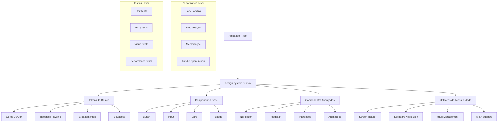

# Arquitetura Técnica - Design System DSGov
## LicitaReview - Implementação Técnica Detalhada

---

## 1. Arquitetura do Sistema

### 1.1 Diagrama de Arquitetura



### 1.2 Stack Tecnológico

- **Frontend**: React 18 + TypeScript + Vite
- **Styling**: Tailwind CSS 4.x + CSS Custom Properties
- **Componentes**: Radix UI + Framer Motion
- **Testes**: Jest + Testing Library + Axe-core
- **Performance**: React Window + Intersection Observer
- **Build**: Vite + Rollup + Bundle Analyzer

---

## 2. Estrutura de Arquivos

### 2.1 Organização do Design System

```
src/
├── design-system/
│   ├── tokens/
│   │   ├── colors.ts
│   │   ├── typography.ts
│   │   ├── spacing.ts
│   │   ├── shadows.ts
│   │   └── index.ts
│   ├── components/
│   │   ├── base/
│   │   │   ├── Button/
│   │   │   │   ├── Button.tsx
│   │   │   │   ├── Button.test.tsx
│   │   │   │   ├── Button.stories.tsx
│   │   │   │   └── index.ts
│   │   │   ├── Input/
│   │   │   ├── Card/
│   │   │   └── Badge/
│   │   ├── advanced/
│   │   │   ├── Navigation/
│   │   │   ├── Feedback/
│   │   │   ├── Interactions/
│   │   │   └── Animations/
│   │   └── index.ts
│   ├── hooks/
│   │   ├── useAccessibility.ts
│   │   ├── usePerformance.ts
│   │   ├── useKeyboard.ts
│   │   └── index.ts
│   ├── utils/
│   │   ├── accessibility.ts
│   │   ├── performance.ts
│   │   ├── validation.ts
│   │   └── index.ts
│   └── index.ts
```

### 2.2 Configuração Tailwind DSGov

```typescript
// tailwind.config.ts
import type { Config } from 'tailwindcss';
import { dsgov } from './src/design-system/tokens';

export default {
  content: [
    './src/**/*.{ts,tsx}',
    './src/design-system/**/*.{ts,tsx}'
  ],
  theme: {
    extend: {
      colors: {
        // Cores DSGov
        'govbr-blue': dsgov.colors.blue,
        'govbr-green': dsgov.colors.green,
        'govbr-yellow': dsgov.colors.yellow,
        'govbr-red': dsgov.colors.red,
        'govbr-gray': dsgov.colors.gray,
      },
      fontFamily: {
        'rawline': ['Rawline', 'sans-serif'],
        'mono': ['JetBrains Mono', 'monospace'],
      },
      fontSize: dsgov.typography.sizes,
      spacing: dsgov.spacing,
      boxShadow: dsgov.shadows,
      borderRadius: dsgov.radius,
      animation: {
        'fade-in': 'fadeIn 0.2s ease-in-out',
        'slide-up': 'slideUp 0.3s ease-out',
        'scale-in': 'scaleIn 0.2s ease-out',
        'pulse-slow': 'pulse 2s cubic-bezier(0.4, 0, 0.6, 1) infinite',
      },
      keyframes: {
        fadeIn: {
          '0%': { opacity: '0' },
          '100%': { opacity: '1' },
        },
        slideUp: {
          '0%': { transform: 'translateY(10px)', opacity: '0' },
          '100%': { transform: 'translateY(0)', opacity: '1' },
        },
        scaleIn: {
          '0%': { transform: 'scale(0.95)', opacity: '0' },
          '100%': { transform: 'scale(1)', opacity: '1' },
        },
      },
    },
  },
  plugins: [
    require('@tailwindcss/forms'),
    require('@tailwindcss/typography'),
    require('tailwindcss-animate'),
  ],
} satisfies Config;
```

---

## 3. Implementação de Tokens

### 3.1 Sistema de Cores DSGov

```typescript
// src/design-system/tokens/colors.ts
export const colors = {
  blue: {
    'vivid-10': '#0C326F',
    'vivid-20': '#1351B4',
    'vivid-30': '#2670E8',
    'vivid-40': '#4B8BF5',
    'vivid-50': '#81B1FA',
    'vivid-60': '#B5D4FF',
    'vivid-70': '#D4E7FF',
    'vivid-80': '#E9F4FF',
    'vivid-90': '#F5FAFF',
  },
  green: {
    'cool-vivid-10': '#0D4F2C',
    'cool-vivid-20': '#168821',
    'cool-vivid-30': '#1F8B24',
    'cool-vivid-40': '#2E8B57',
    'cool-vivid-50': '#4CBB17',
    'cool-vivid-60': '#70CC2A',
    'cool-vivid-70': '#94D83A',
    'cool-vivid-80': '#B8E986',
    'cool-vivid-90': '#E1F5FE',
  },
  yellow: {
    'vivid-10': '#7A4100',
    'vivid-20': '#B54708',
    'vivid-30': '#DC6803',
    'vivid-40': '#F59E0B',
    'vivid-50': '#FBBF24',
    'vivid-60': '#FCD34D',
    'vivid-70': '#FDE68A',
    'vivid-80': '#FEF3C7',
    'vivid-90': '#FFFBEB',
  },
  red: {
    'vivid-10': '#7F1D1D',
    'vivid-20': '#B91C1C',
    'vivid-30': '#DC2626',
    'vivid-40': '#EF4444',
    'vivid-50': '#F87171',
    'vivid-60': '#FCA5A5',
    'vivid-70': '#FECACA',
    'vivid-80': '#FEE2E2',
    'vivid-90': '#FEF2F2',
  },
  gray: {
    '2': '#F8F9FA',
    '5': '#F1F3F4',
    '10': '#E8EAED',
    '20': '#DADCE0',
    '30': '#BDC1C6',
    '40': '#9AA0A6',
    '50': '#80868B',
    '60': '#5F6368',
    '70': '#3C4043',
    '80': '#202124',
    '90': '#171717',
  },
} as const;

// Mapeamento semântico
export const semanticColors = {
  primary: colors.blue['vivid-20'],
  secondary: colors.gray['60'],
  success: colors.green['cool-vivid-30'],
  warning: colors.yellow['vivid-40'],
  error: colors.red['vivid-30'],
  info: colors.blue['vivid-30'],
} as const;
```

### 3.2 Tipografia Rawline

```typescript
// src/design-system/tokens/typography.ts
export const typography = {
  fontFamily: {
    base: ['Rawline', '-apple-system', 'BlinkMacSystemFont', 'Segoe UI', 'Roboto', 'sans-serif'],
    mono: ['JetBrains Mono', 'Fira Code', 'Consolas', 'monospace'],
  },
  sizes: {
    '01': ['0.75rem', { lineHeight: '1rem' }],     // 12px
    '02': ['0.875rem', { lineHeight: '1.25rem' }], // 14px
    '03': ['1rem', { lineHeight: '1.5rem' }],      // 16px
    '04': ['1.125rem', { lineHeight: '1.75rem' }], // 18px
    '05': ['1.25rem', { lineHeight: '1.75rem' }],  // 20px
    '06': ['1.5rem', { lineHeight: '2rem' }],      // 24px
    '07': ['1.875rem', { lineHeight: '2.25rem' }], // 30px
    '08': ['2.25rem', { lineHeight: '2.5rem' }],   // 36px
    '09': ['3rem', { lineHeight: '1' }],           // 48px
    '10': ['4rem', { lineHeight: '1' }],           // 64px
  },
  weights: {
    light: 300,
    regular: 400,
    medium: 500,
    semibold: 600,
    bold: 700,
  },
} as const;
```

---

## 4. Componentes Base Implementados

### 4.1 Button DSGov

```typescript
// src/design-system/components/base/Button/Button.tsx
import React from 'react';
import { cva, type VariantProps } from 'class-variance-authority';
import { cn } from '@/lib/utils';
import { Loader2 } from 'lucide-react';

const buttonVariants = cva(
  [
    'inline-flex items-center justify-center gap-2',
    'rounded-md text-sm font-medium',
    'transition-all duration-200',
    'focus-visible:outline-none focus-visible:ring-2 focus-visible:ring-offset-2',
    'disabled:pointer-events-none disabled:opacity-50',
    'active:scale-[0.98]',
  ],
  {
    variants: {
      variant: {
        primary: [
          'bg-govbr-blue-vivid-20 text-white',
          'hover:bg-govbr-blue-vivid-10',
          'focus-visible:ring-govbr-blue-vivid-30',
        ],
        secondary: [
          'bg-govbr-gray-10 text-govbr-gray-80',
          'hover:bg-govbr-gray-20',
          'focus-visible:ring-govbr-gray-30',
        ],
        outline: [
          'border border-govbr-blue-vivid-20 text-govbr-blue-vivid-20',
          'hover:bg-govbr-blue-vivid-90',
          'focus-visible:ring-govbr-blue-vivid-30',
        ],
        danger: [
          'bg-govbr-red-vivid-30 text-white',
          'hover:bg-govbr-red-vivid-20',
          'focus-visible:ring-govbr-red-vivid-40',
        ],
        ghost: [
          'text-govbr-gray-70',
          'hover:bg-govbr-gray-10',
          'focus-visible:ring-govbr-gray-30',
        ],
      },
      size: {
        sm: 'h-8 px-3 text-xs',
        md: 'h-10 px-4 text-sm',
        lg: 'h-12 px-6 text-base',
        icon: 'h-10 w-10',
      },
    },
    defaultVariants: {
      variant: 'primary',
      size: 'md',
    },
  }
);

export interface ButtonProps
  extends React.ButtonHTMLAttributes<HTMLButtonElement>,
    VariantProps<typeof buttonVariants> {
  loading?: boolean;
  loadingText?: string;
  leftIcon?: React.ReactNode;
  rightIcon?: React.ReactNode;
  // Acessibilidade
  ariaLabel?: string;
  announceOnClick?: string;
}

const Button = React.forwardRef<HTMLButtonElement, ButtonProps>(
  (
    {
      className,
      variant,
      size,
      loading = false,
      loadingText,
      leftIcon,
      rightIcon,
      children,
      disabled,
      ariaLabel,
      announceOnClick,
      onClick,
      ...props
    },
    ref
  ) => {
    const handleClick = (event: React.MouseEvent<HTMLButtonElement>) => {
      if (announceOnClick) {
        // Anunciar ação para screen readers
        const announcement = document.createElement('div');
        announcement.setAttribute('aria-live', 'polite');
        announcement.setAttribute('aria-atomic', 'true');
        announcement.className = 'sr-only';
        announcement.textContent = announceOnClick;
        document.body.appendChild(announcement);
        setTimeout(() => document.body.removeChild(announcement), 1000);
      }
      
      onClick?.(event);
    };

    return (
      <button
        className={cn(buttonVariants({ variant, size, className }))}
        ref={ref}
        disabled={disabled || loading}
        aria-label={ariaLabel}
        onClick={handleClick}
        {...props}
      >
        {loading && (
          <Loader2 className="h-4 w-4 animate-spin" aria-hidden="true" />
        )}
        {!loading && leftIcon && (
          <span className="flex-shrink-0" aria-hidden="true">
            {leftIcon}
          </span>
        )}
        <span className={loading ? 'sr-only' : undefined}>
          {loading && loadingText ? loadingText : children}
        </span>
        {!loading && rightIcon && (
          <span className="flex-shrink-0" aria-hidden="true">
            {rightIcon}
          </span>
        )}
      </button>
    );
  }
);

Button.displayName = 'Button';

export { Button, buttonVariants };
```

### 4.2 Input Acessível

```typescript
// src/design-system/components/base/Input/Input.tsx
import React from 'react';
import { cva, type VariantProps } from 'class-variance-authority';
import { cn } from '@/lib/utils';
import { AlertCircle, CheckCircle } from 'lucide-react';

const inputVariants = cva(
  [
    'flex w-full rounded-md border px-3 py-2',
    'text-sm font-rawline',
    'transition-colors duration-200',
    'focus-visible:outline-none focus-visible:ring-2 focus-visible:ring-offset-2',
    'disabled:cursor-not-allowed disabled:opacity-50',
    'placeholder:text-govbr-gray-40',
  ],
  {
    variants: {
      state: {
        default: [
          'border-govbr-gray-30 bg-white',
          'focus-visible:border-govbr-blue-vivid-20',
          'focus-visible:ring-govbr-blue-vivid-30',
        ],
        error: [
          'border-govbr-red-vivid-30 bg-govbr-red-vivid-90',
          'focus-visible:border-govbr-red-vivid-20',
          'focus-visible:ring-govbr-red-vivid-40',
        ],
        success: [
          'border-govbr-green-cool-vivid-30 bg-govbr-green-cool-vivid-90',
          'focus-visible:border-govbr-green-cool-vivid-20',
          'focus-visible:ring-govbr-green-cool-vivid-40',
        ],
      },
      size: {
        sm: 'h-8 text-xs',
        md: 'h-10 text-sm',
        lg: 'h-12 text-base',
      },
    },
    defaultVariants: {
      state: 'default',
      size: 'md',
    },
  }
);

export interface InputProps
  extends React.InputHTMLAttributes<HTMLInputElement>,
    VariantProps<typeof inputVariants> {
  label?: string;
  error?: string;
  hint?: string;
  required?: boolean;
  leftIcon?: React.ReactNode;
  rightIcon?: React.ReactNode;
  // Acessibilidade
  describedBy?: string[];
  announceErrors?: boolean;
}

const Input = React.forwardRef<HTMLInputElement, InputProps>(
  (
    {
      className,
      state,
      size,
      label,
      error,
      hint,
      required,
      leftIcon,
      rightIcon,
      id,
      describedBy = [],
      announceErrors = true,
      ...props
    },
    ref
  ) => {
    const inputId = id || React.useId();
    const errorId = `${inputId}-error`;
    const hintId = `${inputId}-hint`;
    
    const ariaDescribedBy = [
      ...describedBy,
      hint ? hintId : null,
      error ? errorId : null,
    ].filter(Boolean).join(' ');

    const finalState = error ? 'error' : state;
    const StatusIcon = error ? AlertCircle : state === 'success' ? CheckCircle : null;

    return (
      <div className="space-y-2">
        {label && (
          <label
            htmlFor={inputId}
            className="block text-sm font-medium text-govbr-gray-80"
          >
            {label}
            {required && (
              <span className="ml-1 text-govbr-red-vivid-30" aria-label="obrigatório">
                *
              </span>
            )}
          </label>
        )}
        
        <div className="relative">
          {leftIcon && (
            <div className="absolute left-3 top-1/2 -translate-y-1/2 text-govbr-gray-40">
              {leftIcon}
            </div>
          )}
          
          <input
            className={cn(
              inputVariants({ state: finalState, size }),
              leftIcon && 'pl-10',
              (rightIcon || StatusIcon) && 'pr-10',
              className
            )}
            ref={ref}
            id={inputId}
            aria-describedby={ariaDescribedBy || undefined}
            aria-invalid={error ? 'true' : undefined}
            aria-required={required}
            {...props}
          />
          
          {(rightIcon || StatusIcon) && (
            <div className="absolute right-3 top-1/2 -translate-y-1/2">
              {StatusIcon ? (
                <StatusIcon
                  className={cn(
                    'h-4 w-4',
                    error ? 'text-govbr-red-vivid-30' : 'text-govbr-green-cool-vivid-30'
                  )}
                  aria-hidden="true"
                />
              ) : (
                rightIcon
              )}
            </div>
          )}
        </div>
        
        {hint && (
          <p id={hintId} className="text-xs text-govbr-gray-60">
            {hint}
          </p>
        )}
        
        {error && (
          <p
            id={errorId}
            className="text-xs text-govbr-red-vivid-30"
            role={announceErrors ? 'alert' : undefined}
            aria-live={announceErrors ? 'polite' : undefined}
          >
            {error}
          </p>
        )}
      </div>
    );
  }
);

Input.displayName = 'Input';

export { Input, inputVariants };
```

---

## 5. Hooks de Acessibilidade

### 5.1 useKeyboardNavigation

```typescript
// src/design-system/hooks/useKeyboardNavigation.ts
import { useEffect, useRef, useCallback } from 'react';

interface KeyboardNavigationOptions {
  enabled?: boolean;
  trapFocus?: boolean;
  restoreFocus?: boolean;
  initialFocus?: string;
  onEscape?: () => void;
  shortcuts?: Record<string, () => void>;
}

export function useKeyboardNavigation({
  enabled = true,
  trapFocus = false,
  restoreFocus = false,
  initialFocus,
  onEscape,
  shortcuts = {},
}: KeyboardNavigationOptions = {}) {
  const containerRef = useRef<HTMLElement>(null);
  const previousActiveElement = useRef<Element | null>(null);
  const focusableElements = useRef<HTMLElement[]>([]);

  const getFocusableElements = useCallback(() => {
    if (!containerRef.current) return [];
    
    const selector = [
      'button:not([disabled])',
      'input:not([disabled])',
      'select:not([disabled])',
      'textarea:not([disabled])',
      'a[href]',
      '[tabindex]:not([tabindex="-1"])',
      '[contenteditable="true"]',
    ].join(', ');
    
    return Array.from(containerRef.current.querySelectorAll(selector)) as HTMLElement[];
  }, []);

  const handleKeyDown = useCallback(
    (event: KeyboardEvent) => {
      if (!enabled) return;

      // Atalhos personalizados
      const shortcutKey = `${event.ctrlKey ? 'ctrl+' : ''}${event.altKey ? 'alt+' : ''}${event.shiftKey ? 'shift+' : ''}${event.key.toLowerCase()}`;
      if (shortcuts[shortcutKey]) {
        event.preventDefault();
        shortcuts[shortcutKey]();
        return;
      }

      // Escape
      if (event.key === 'Escape' && onEscape) {
        event.preventDefault();
        onEscape();
        return;
      }

      // Focus trap
      if (trapFocus && event.key === 'Tab') {
        const focusable = getFocusableElements();
        if (focusable.length === 0) return;

        const firstElement = focusable[0];
        const lastElement = focusable[focusable.length - 1];
        const activeElement = document.activeElement as HTMLElement;

        if (event.shiftKey) {
          if (activeElement === firstElement) {
            event.preventDefault();
            lastElement.focus();
          }
        } else {
          if (activeElement === lastElement) {
            event.preventDefault();
            firstElement.focus();
          }
        }
      }
    },
    [enabled, trapFocus, onEscape, shortcuts, getFocusableElements]
  );

  useEffect(() => {
    if (!enabled) return;

    // Salvar elemento ativo anterior
    if (restoreFocus) {
      previousActiveElement.current = document.activeElement;
    }

    // Focar elemento inicial
    if (initialFocus && containerRef.current) {
      const element = containerRef.current.querySelector(initialFocus) as HTMLElement;
      if (element) {
        element.focus();
      }
    }

    // Adicionar listener
    document.addEventListener('keydown', handleKeyDown);

    return () => {
      document.removeEventListener('keydown', handleKeyDown);
      
      // Restaurar foco
      if (restoreFocus && previousActiveElement.current) {
        (previousActiveElement.current as HTMLElement).focus();
      }
    };
  }, [enabled, initialFocus, restoreFocus, handleKeyDown]);

  return {
    containerRef,
    focusableElements: getFocusableElements(),
  };
}
```

### 5.2 useAnnouncement

```typescript
// src/design-system/hooks/useAnnouncement.ts
import { useCallback } from 'react';

type AnnouncementPriority = 'polite' | 'assertive';

export function useAnnouncement() {
  const announce = useCallback(
    (message: string, priority: AnnouncementPriority = 'polite') => {
      const announcement = document.createElement('div');
      announcement.setAttribute('aria-live', priority);
      announcement.setAttribute('aria-atomic', 'true');
      announcement.className = 'sr-only';
      announcement.textContent = message;
      
      document.body.appendChild(announcement);
      
      // Remover após anúncio
      setTimeout(() => {
        if (document.body.contains(announcement)) {
          document.body.removeChild(announcement);
        }
      }, 1000);
    },
    []
  );

  const announcePolite = useCallback(
    (message: string) => announce(message, 'polite'),
    [announce]
  );

  const announceAssertive = useCallback(
    (message: string) => announce(message, 'assertive'),
    [announce]
  );

  return {
    announce,
    announcePolite,
    announceAssertive,
  };
}
```

---

## 6. Testes de Acessibilidade

### 6.1 Configuração de Testes A11y

```typescript
// src/test/a11y-utils.ts
import { render, RenderOptions } from '@testing-library/react';
import { axe, toHaveNoViolations } from 'jest-axe';
import userEvent from '@testing-library/user-event';

// Estender matchers do Jest
expect.extend(toHaveNoViolations);

// Wrapper para testes de acessibilidade
export function renderWithA11y(
  ui: React.ReactElement,
  options?: RenderOptions
) {
  const result = render(ui, options);
  
  return {
    ...result,
    // Teste de acessibilidade
    async checkA11y() {
      const results = await axe(result.container);
      expect(results).toHaveNoViolations();
      return results;
    },
    // User event com acessibilidade
    user: userEvent.setup(),
  };
}

// Configuração personalizada do axe
export const a11yConfig = {
  rules: {
    // Regras específicas para DSGov
    'color-contrast': { enabled: true },
    'keyboard-navigation': { enabled: true },
    'focus-management': { enabled: true },
    'aria-labels': { enabled: true },
  },
  tags: ['wcag2a', 'wcag2aa', 'wcag21aa'],
};
```

### 6.2 Exemplo de Teste A11y

```typescript
// src/design-system/components/base/Button/Button.test.tsx
import { renderWithA11y, a11yConfig } from '@/test/a11y-utils';
import { Button } from './Button';

describe('Button Accessibility', () => {
  it('should have no accessibility violations', async () => {
    const { checkA11y } = renderWithA11y(
      <Button>Clique aqui</Button>
    );
    
    await checkA11y();
  });

  it('should be keyboard navigable', async () => {
    const handleClick = jest.fn();
    const { getByRole, user } = renderWithA11y(
      <Button onClick={handleClick}>Clique aqui</Button>
    );
    
    const button = getByRole('button');
    
    // Testar foco
    await user.tab();
    expect(button).toHaveFocus();
    
    // Testar ativação por teclado
    await user.keyboard('{Enter}');
    expect(handleClick).toHaveBeenCalledTimes(1);
    
    await user.keyboard(' ');
    expect(handleClick).toHaveBeenCalledTimes(2);
  });

  it('should announce loading state', async () => {
    const { getByRole, rerender } = renderWithA11y(
      <Button loading loadingText="Carregando...">
        Enviar
      </Button>
    );
    
    const button = getByRole('button');
    expect(button).toHaveAttribute('aria-disabled', 'true');
    expect(button).toHaveTextContent('Carregando...');
  });

  it('should have proper contrast ratios', async () => {
    const { container } = renderWithA11y(
      <div>
        <Button variant="primary">Primário</Button>
        <Button variant="secondary">Secundário</Button>
        <Button variant="danger">Perigo</Button>
      </div>
    );
    
    const results = await axe(container, {
      ...a11yConfig,
      rules: {
        ...a11yConfig.rules,
        'color-contrast': { enabled: true },
      },
    });
    
    expect(results).toHaveNoViolations();
  });
});
```

---

## 7. Performance e Otimização

### 7.1 Lazy Loading de Componentes

```typescript
// src/design-system/utils/lazy-loading.ts
import { lazy, Suspense, ComponentType } from 'react';
import { ComponentSkeleton } from '../components/feedback/Skeleton';

interface LazyComponentOptions {
  fallback?: ComponentType;
  delay?: number;
  retries?: number;
}

export function createLazyComponent<T extends object>(
  importFn: () => Promise<{ default: ComponentType<T> }>,
  options: LazyComponentOptions = {}
) {
  const {
    fallback: Fallback = ComponentSkeleton,
    delay = 0,
    retries = 3,
  } = options;

  // Implementar retry logic
  const importWithRetry = async (): Promise<{ default: ComponentType<T> }> => {
    let lastError: Error;
    
    for (let i = 0; i < retries; i++) {
      try {
        if (delay > 0) {
          await new Promise(resolve => setTimeout(resolve, delay));
        }
        return await importFn();
      } catch (error) {
        lastError = error as Error;
        console.warn(`Failed to load component (attempt ${i + 1}/${retries}):`, error);
        
        if (i < retries - 1) {
          // Exponential backoff
          await new Promise(resolve => setTimeout(resolve, Math.pow(2, i) * 1000));
        }
      }
    }
    
    throw lastError!;
  };

  const LazyComponent = lazy(importWithRetry);
  
  return function WrappedLazyComponent(props: T) {
    return (
      <Suspense fallback={<Fallback />}>
        <LazyComponent {...props} />
      </Suspense>
    );
  };
}

// Exemplo de uso
export const LazyDocumentAnalyzer = createLazyComponent(
  () => import('../components/advanced/DocumentAnalyzer'),
  { delay: 100, retries: 3 }
);
```

### 7.2 Virtualização Otimizada

```typescript
// src/design-system/components/advanced/VirtualizedList.tsx
import React, { useMemo, useCallback } from 'react';
import { FixedSizeList as List, ListChildComponentProps } from 'react-window';
import { useIntersectionObserver } from '../hooks/useIntersectionObserver';

interface VirtualizedListProps<T> {
  items: T[];
  itemHeight: number;
  height: number;
  width?: number | string;
  renderItem: (item: T, index: number) => React.ReactNode;
  onLoadMore?: () => void;
  hasNextPage?: boolean;
  loading?: boolean;
  overscan?: number;
  threshold?: number;
}

export function VirtualizedList<T>({
  items,
  itemHeight,
  height,
  width = '100%',
  renderItem,
  onLoadMore,
  hasNextPage = false,
  loading = false,
  overscan = 5,
  threshold = 0.8,
}: VirtualizedListProps<T>) {
  const { ref: loadMoreRef, isIntersecting } = useIntersectionObserver({
    threshold,
  });

  // Trigger load more when sentinel is visible
  React.useEffect(() => {
    if (isIntersecting && hasNextPage && !loading && onLoadMore) {
      onLoadMore();
    }
  }, [isIntersecting, hasNextPage, loading, onLoadMore]);

  const Row = useCallback(
    ({ index, style }: ListChildComponentProps) => {
      const item = items[index];
      
      return (
        <div style={style} role="listitem">
          {renderItem(item, index)}
          {/* Sentinel para infinite scroll */}
          {index === items.length - 1 && hasNextPage && (
            <div ref={loadMoreRef} className="h-1" />
          )}
        </div>
      );
    },
    [items, renderItem, hasNextPage, loadMoreRef]
  );

  const itemCount = useMemo(() => {
    return hasNextPage ? items.length + 1 : items.length;
  }, [items.length, hasNextPage]);

  return (
    <div role="list" aria-label={`Lista com ${items.length} itens`}>
      <List
        height={height}
        width={width}
        itemCount={itemCount}
        itemSize={itemHeight}
        overscanCount={overscan}
      >
        {Row}
      </List>
      
      {loading && (
        <div className="flex justify-center p-4" aria-live="polite">
          <span className="text-sm text-govbr-gray-60">
            Carregando mais itens...
          </span>
        </div>
      )}
    </div>
  );
}
```

---

## 8. Monitoramento e Métricas

### 8.1 Performance Monitoring

```typescript
// src/design-system/utils/performance.ts
import { getCLS, getFID, getFCP, getLCP, getTTFB } from 'web-vitals';

interface PerformanceMetrics {
  fcp: number;
  lcp: number;
  fid: number;
  cls: number;
  ttfb: number;
}

class PerformanceMonitor {
  private metrics: Partial<PerformanceMetrics> = {};
  private observers: PerformanceObserver[] = [];

  constructor() {
    this.initWebVitals();
    this.initCustomMetrics();
  }

  private initWebVitals() {
    getCLS((metric) => {
      this.metrics.cls = metric.value;
      this.reportMetric('CLS', metric.value);
    });

    getFID((metric) => {
      this.metrics.fid = metric.value;
      this.reportMetric('FID', metric.value);
    });

    getFCP((metric) => {
      this.metrics.fcp = metric.value;
      this.reportMetric('FCP', metric.value);
    });

    getLCP((metric) => {
      this.metrics.lcp = metric.value;
      this.reportMetric('LCP', metric.value);
    });

    getTTFB((metric) => {
      this.metrics.ttfb = metric.value;
      this.reportMetric('TTFB', metric.value);
    });
  }

  private initCustomMetrics() {
    // Component render time
    if ('PerformanceObserver' in window) {
      const observer = new PerformanceObserver((list) => {
        list.getEntries().forEach((entry) => {
          if (entry.name.startsWith('component-')) {
            this.reportMetric('Component Render', entry.duration);
          }
        });
      });
      
      observer.observe({ entryTypes: ['measure'] });
      this.observers.push(observer);
    }
  }

  private reportMetric(name: string, value: number) {
    // Enviar para analytics
    if (process.env.NODE_ENV === 'production') {
      // Analytics integration
      console.log(`Performance Metric - ${name}:`, value);
    }
  }

  measureComponent(name: string, fn: () => void) {
    const startMark = `${name}-start`;
    const endMark = `${name}-end`;
    const measureName = `component-${name}`;

    performance.mark(startMark);
    fn();
    performance.mark(endMark);
    performance.measure(measureName, startMark, endMark);
  }

  getMetrics(): Partial<PerformanceMetrics> {
    return { ...this.metrics };
  }

  destroy() {
    this.observers.forEach(observer => observer.disconnect());
    this.observers = [];
  }
}

export const performanceMonitor = new PerformanceMonitor();
```

---

## 9. Conclusão

Esta arquitetura técnica fornece uma base sólida para implementar o Design System DSGov completo no projeto LicitaReview, garantindo:

- **Conformidade com padrões governamentais**
- **Acessibilidade WCAG 2.1 AA**
- **Performance otimizada**
- **Manutenibilidade e escalabilidade**
- **Testes automatizados**
- **Monitoramento contínuo**

A implementação deve seguir as fases definidas no documento principal, com foco em qualidade e experiência do usuário.

---

**Documento técnico criado em:** Janeiro 2025  
**Versão:** 1.0  
**Responsável:** Arquitetura de Frontend