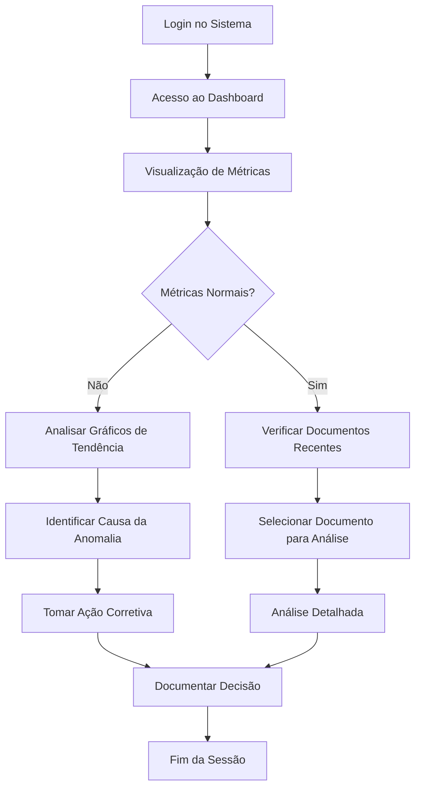
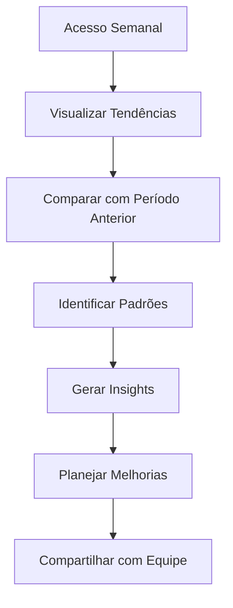

# Marco 1: Dashboard Funcional - Documentação Lean Inception

## 1. Visão do Produto

**Template de Visão:**
```
Para GESTORES PÚBLICOS E ANALISTAS DE LICITAÇÕES
Cujo NECESSIDADE DE MONITORAR E ANALISAR DOCUMENTOS LICITATÓRIOS EM TEMPO REAL
O DASHBOARD FUNCIONAL DO LICITAREVIEW
É um PAINEL DE CONTROLE INTELIGENTE
Que FORNECE MÉTRICAS CLARAS, GRÁFICOS INTERATIVOS E VISÃO CONSOLIDADA DOS DOCUMENTOS
Diferentemente de PLANILHAS ESTÁTICAS E RELATÓRIOS MANUAIS
O nosso produto OFERECE ANÁLISE VISUAL EM TEMPO REAL COM INSIGHTS ACIONÁVEIS
```

## 2. Canvas MVP - 7 Blocos Essenciais

### 2.1 Personas
**Quem são os usuários?**
- **Gestor Público Senior**: Precisa de visão executiva e métricas de alto nível
- **Analista de Licitações**: Necessita de detalhes operacionais e acompanhamento de documentos
- **Coordenador de Equipe**: Busca métricas de performance e distribuição de trabalho

### 2.2 Proposta de Valor
**Qual problema resolve?**
- Elimina a necessidade de consultar múltiplas fontes para obter status dos documentos
- Reduz tempo de análise manual de métricas de conformidade
- Fornece visibilidade imediata sobre tendências e padrões

### 2.3 Jornadas
**Quais fluxos de uso são atendidos?**
- **Jornada do Gestor**: Acesso rápido → Visão geral → Métricas executivas → Decisões estratégicas
- **Jornada do Analista**: Login → Dashboard → Documentos recentes → Análise detalhada → Ações corretivas
- **Jornada de Monitoramento**: Abertura diária → Verificação de tendências → Identificação de anomalias → Relatórios

### 2.4 Funcionalidades
**O que será construído?**
- **Métricas Básicas Claras**: Cards visuais com KPIs essenciais (total documentos, score médio, tempo processamento, taxa sucesso)
- **Gráficos Interativos**: Visualizações de tendências temporais e distribuições
- **Tabela de Documentos Recentes**: Lista organizada com filtros e ações rápidas
- **Sistema de Atualização**: Refresh automático e manual dos dados

### 2.5 Resultado Esperado
**Que aprendizado queremos obter?**
- Validar se métricas visuais aumentam eficiência de tomada de decisão
- Confirmar se gráficos interativos melhoram identificação de padrões
- Testar se organização tabular facilita acesso a documentos específicos
- Medir impacto na redução de tempo para obter insights

### 2.6 Métricas
**Como medir sucesso/falha?**
- **Adoção**: 80% dos usuários acessam dashboard diariamente
- **Eficiência**: 50% redução no tempo para obter métricas
- **Satisfação**: NPS > 8 para usabilidade do dashboard
- **Engajamento**: Média de 5+ interações por sessão
- **Performance**: Carregamento < 2 segundos

### 2.7 Custo e Cronograma
**Investimento e prazo necessários?**
- **Prazo**: 1 semana (Semana 20)
- **Esforço**: 32 horas de desenvolvimento
- **Recursos**: 1 desenvolvedor frontend + 1 designer UX
- **Custo**: Aproveitamento de 70% da estrutura existente

## 3. Personas Detalhadas

### 3.1 Persona Primária: Ana - Gestora de Licitações
- **Perfil**: 45 anos, 15 anos de experiência, gerencia equipe de 8 analistas
- **Necessidades**: Visão executiva, métricas de performance, identificação rápida de problemas
- **Comportamento**: Acessa sistema 3x/dia, prefere informações visuais, toma decisões baseadas em dados
- **Dores**: Perda de tempo compilando relatórios, dificuldade para identificar tendências
- **Objetivos**: Aumentar eficiência da equipe, reduzir retrabalho, melhorar qualidade das análises

### 3.2 Persona Secundária: Carlos - Analista Sênior
- **Perfil**: 32 anos, 8 anos de experiência, especialista em conformidade
- **Necessidades**: Acesso rápido a documentos, métricas detalhadas, histórico de análises
- **Comportamento**: Usuário intensivo, trabalha com múltiplos documentos simultaneamente
- **Dores**: Interface complexa, informações dispersas, falta de contexto histórico
- **Objetivos**: Acelerar análises, melhorar precisão, ter visão completa do processo

### 3.3 Persona Terciária: Maria - Coordenadora Técnica
- **Perfil**: 38 anos, 10 anos de experiência, foco em qualidade e processos
- **Necessidades**: Métricas de qualidade, distribuição de trabalho, identificação de gargalos
- **Comportamento**: Monitora performance da equipe, gera relatórios semanais
- **Dores**: Falta de visibilidade sobre carga de trabalho, dificuldade para balancear demanda
- **Objetivos**: Otimizar distribuição de tarefas, manter qualidade alta, reduzir tempo de ciclo

## 4. Matriz de Avaliação de Funcionalidades

| Funcionalidade | Esforço | Valor Negócio | Valor UX | Confiança | Prioridade |
|---|---|---|---|---|---|
| Cards de Métricas Básicas | E | $$$ | ♥♥♥ | 🟢 | ALTA |
| Gráfico de Tendências Temporais | EE | $$$ | ♥♥♥ | 🟢 | ALTA |
| Tabela de Documentos Recentes | E | $$ | ♥♥ | 🟢 | ALTA |
| Filtros e Busca na Tabela | EE | $$ | ♥♥♥ | 🟢 | MÉDIA |
| Gráficos de Distribuição | EE | $$ | ♥♥ | 🟡 | MÉDIA |
| Refresh Automático | E | $ | ♥ | 🟢 | BAIXA |
| Exportação de Dados | EE | $ | ♥ | 🟡 | BAIXA |
| Notificações de Anomalias | EEE | $$$ | ♥♥ | 🔴 | FUTURA |

**Legenda:**
- **Esforço**: E (1-2 dias), EE (3-4 dias), EEE (5+ dias)
- **Valor Negócio**: $ (baixo), $$ (médio), $$$ (alto)
- **Valor UX**: ♥ (básico), ♥♥ (bom), ♥♥♥ (excelente)
- **Confiança**: 🟢 (alta), 🟡 (média), 🔴 (baixa)

## 5. Jornadas do Usuário Detalhadas

### 5.1 Jornada Principal: Monitoramento Diário


### 5.2 Jornada Secundária: Análise de Performance


## 6. Sequenciamento em Ondas

### 6.1 Onda 1 - MVP Core (Dias 1-3)
**Funcionalidades Essenciais:**
- ✅ Cards de métricas básicas (aproveitando MetricsCards existente)
- ✅ Gráfico de tendências de documentos (aproveitando TrendsChart existente)
- ✅ Tabela básica de documentos recentes (aproveitando DocumentsTable existente)
- 🔄 Integração e refinamento da interface

**Critérios de Aceitação:**
- Dashboard carrega em < 3 segundos
- Métricas são atualizadas corretamente
- Gráficos são interativos e responsivos
- Tabela exibe últimos 10 documentos

### 6.2 Onda 2 - Melhorias UX (Dias 4-5)
**Funcionalidades de Valor:**
- 🆕 Sistema de filtros na tabela
- 🆕 Busca por nome de documento
- 🆕 Ordenação por colunas
- 🆕 Refresh manual com indicador visual

**Critérios de Aceitação:**
- Filtros funcionam em tempo real
- Busca retorna resultados relevantes
- Ordenação mantém estado da sessão
- Refresh atualiza dados sem reload da página

### 6.3 Onda 3 - Polimento (Dias 6-7)
**Funcionalidades de Polimento:**
- 🆕 Animações e transições suaves
- 🆕 Estados de loading otimizados
- 🆕 Tratamento de erros elegante
- 🆕 Tooltips informativos

**Critérios de Aceitação:**
- Animações não impactam performance
- Estados de loading são informativos
- Erros são tratados graciosamente
- Tooltips fornecem contexto útil

## 7. Especificações Técnicas

### 7.1 Componentes Existentes (Aproveitamento)
- **MetricsCards.tsx**: 90% aproveitável, necessita apenas ajustes de dados
- **TrendsChart.tsx**: 85% aproveitável, adicionar interatividade
- **DocumentsTable.tsx**: 80% aproveitável, melhorar filtros e busca
- **DashboardPage.tsx**: 70% aproveitável, reorganizar layout

### 7.2 Melhorias Necessárias

#### 7.2.1 MetricsCards
```typescript
// Adicionar props para customização
interface MetricsCardsProps {
  data: OverviewData;
  refreshing?: boolean;
  onRefresh?: () => void;
  variant?: 'compact' | 'detailed';
}
```

#### 7.2.2 TrendsChart
```typescript
// Adicionar interatividade
interface TrendsChartProps {
  data: any[];
  title: string;
  type: 'documents' | 'processing' | 'distribution' | 'scores';
  interactive?: boolean;
  onDataPointClick?: (data: any) => void;
  timeRange?: '7d' | '30d' | '90d';
}
```

#### 7.2.3 DocumentsTable
```typescript
// Melhorar funcionalidades de filtro
interface DocumentsTableProps {
  documents: Document[];
  showAll?: boolean;
  enableSearch?: boolean;
  enableFilters?: boolean;
  enableSorting?: boolean;
  onDocumentClick?: (document: Document) => void;
  onBulkAction?: (documents: Document[], action: string) => void;
}
```

### 7.3 Novos Hooks Necessários

#### 7.3.1 useDashboardData
```typescript
const useDashboardData = () => {
  const [data, setData] = useState(null);
  const [loading, setLoading] = useState(true);
  const [error, setError] = useState(null);
  const [lastUpdated, setLastUpdated] = useState(new Date());
  
  const refresh = useCallback(() => {
    // Implementar refresh dos dados
  }, []);
  
  return { data, loading, error, lastUpdated, refresh };
};
```

#### 7.3.2 useAutoRefresh
```typescript
const useAutoRefresh = (callback: () => void, interval: number = 30000) => {
  // Implementar auto-refresh configurável
};
```

## 8. Métricas de Sucesso

### 8.1 Métricas de Adoção
- **Taxa de Uso Diário**: Meta 80% dos usuários ativos
- **Tempo de Primeira Interação**: Meta < 5 segundos
- **Sessões por Usuário/Dia**: Meta 3+ sessões
- **Tempo Médio de Sessão**: Meta 5-10 minutos

### 8.2 Métricas de Performance
- **Tempo de Carregamento Inicial**: Meta < 2 segundos
- **Tempo de Refresh**: Meta < 1 segundo
- **Taxa de Erro**: Meta < 1%
- **Disponibilidade**: Meta 99.5%

### 8.3 Métricas de Valor
- **Redução no Tempo para Obter Insights**: Meta 50%
- **Aumento na Identificação de Anomalias**: Meta 30%
- **Satisfação do Usuário (NPS)**: Meta > 8
- **Redução de Consultas de Suporte**: Meta 25%

### 8.4 Métricas de Qualidade
- **Precisão dos Dados**: Meta 99%
- **Consistência entre Visualizações**: Meta 100%
- **Tempo de Resolução de Bugs**: Meta < 24h
- **Cobertura de Testes**: Meta > 80%

## 9. Estimativas Detalhadas

### 9.1 Breakdown por Onda

#### Onda 1 - MVP Core (20 horas)
- Refinamento MetricsCards: 4 horas
- Melhoria TrendsChart: 6 horas
- Otimização DocumentsTable: 4 horas
- Integração e layout: 4 horas
- Testes básicos: 2 horas

#### Onda 2 - Melhorias UX (8 horas)
- Sistema de filtros: 3 horas
- Busca e ordenação: 3 horas
- Refresh manual: 2 horas

#### Onda 3 - Polimento (4 horas)
- Animações e transições: 2 horas
- Estados de loading: 1 hora
- Tratamento de erros: 1 hora

**Total Estimado: 32 horas (4 dias úteis)**

### 9.2 Recursos Necessários
- **Desenvolvedor Frontend Senior**: 32 horas
- **Designer UX (consultoria)**: 4 horas
- **QA/Testes**: 4 horas
- **Product Owner (validação)**: 2 horas

## 10. Critérios de Pronto (Definition of Done)

### 10.1 Funcionalidade
- ✅ Todas as funcionalidades da onda implementadas
- ✅ Testes unitários com cobertura > 80%
- ✅ Testes de integração passando
- ✅ Performance dentro dos SLAs definidos

### 10.2 Qualidade
- ✅ Code review aprovado
- ✅ Lint e type-check sem erros
- ✅ Acessibilidade básica (WCAG 2.1 AA)
- ✅ Responsividade testada (mobile/desktop)

### 10.3 Documentação
- ✅ Documentação técnica atualizada
- ✅ Guia do usuário básico
- ✅ Changelog atualizado
- ✅ Métricas de baseline coletadas

### 10.4 Deploy
- ✅ Deploy em ambiente de staging
- ✅ Testes de aceitação do usuário
- ✅ Validação de métricas de performance
- ✅ Aprovação para produção

## 11. Riscos e Mitigações

### 11.1 Riscos Técnicos
- **Risco**: Performance degradada com grandes volumes de dados
- **Mitigação**: Implementar paginação e lazy loading
- **Probabilidade**: Média | **Impacto**: Alto

- **Risco**: Incompatibilidade com browsers antigos
- **Mitigação**: Definir browser support policy e polyfills
- **Probabilidade**: Baixa | **Impacto**: Médio

### 11.2 Riscos de Produto
- **Risco**: Usuários não adotam o dashboard
- **Mitigação**: Sessões de treinamento e feedback contínuo
- **Probabilidade**: Baixa | **Impacto**: Alto

- **Risco**: Métricas não refletem necessidades reais
- **Mitigação**: Validação com usuários-chave antes do desenvolvimento
- **Probabilidade**: Média | **Impacto**: Médio

### 11.3 Riscos de Cronograma
- **Risco**: Complexidade subestimada
- **Mitigação**: Buffer de 20% no cronograma e priorização clara
- **Probabilidade**: Média | **Impacto**: Médio

## 12. Próximos Passos

### 12.1 Imediatos (Semana 20)
1. **Dia 1**: Kickoff e refinamento de requisitos
2. **Dia 2-3**: Desenvolvimento Onda 1 (MVP Core)
3. **Dia 4**: Desenvolvimento Onda 2 (Melhorias UX)
4. **Dia 5**: Desenvolvimento Onda 3 (Polimento) + Testes

### 12.2 Pós-Entrega
1. **Semana 21**: Coleta de feedback e métricas
2. **Semana 22**: Análise de dados e identificação de melhorias
3. **Semana 23**: Planejamento do Marco 2 baseado em aprendizados

### 12.3 Evolução Futura
- **Marco 2**: Dashboard Analytics Avançado
- **Marco 3**: Alertas e Notificações Inteligentes
- **Marco 4**: Personalização por Usuário
- **Marco 5**: Integração com Sistemas Externos

---

**Documento criado seguindo metodologia Lean Inception**  
**Versão**: 1.0  
**Data**: Janeiro 2025  
**Responsável**: Equipe LicitaReview  
**Próxima Revisão**: Fim da Semana 20