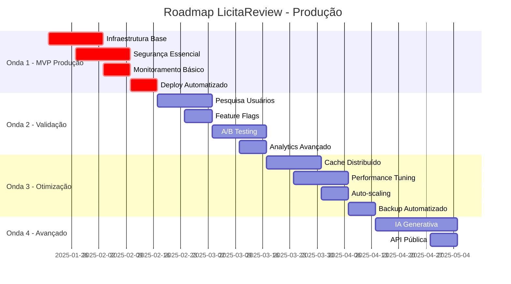
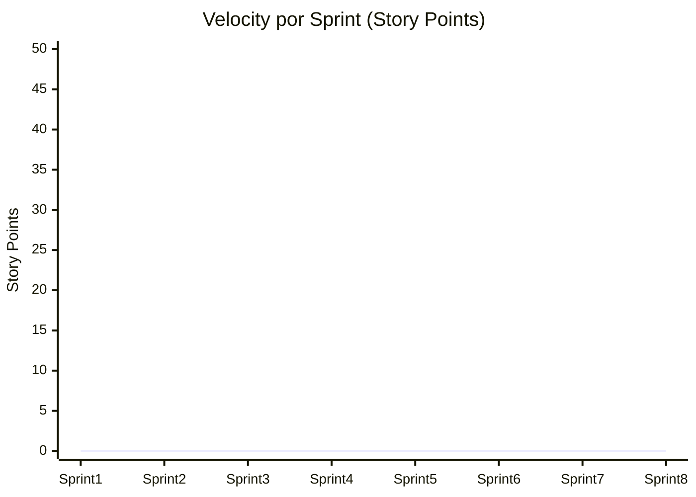
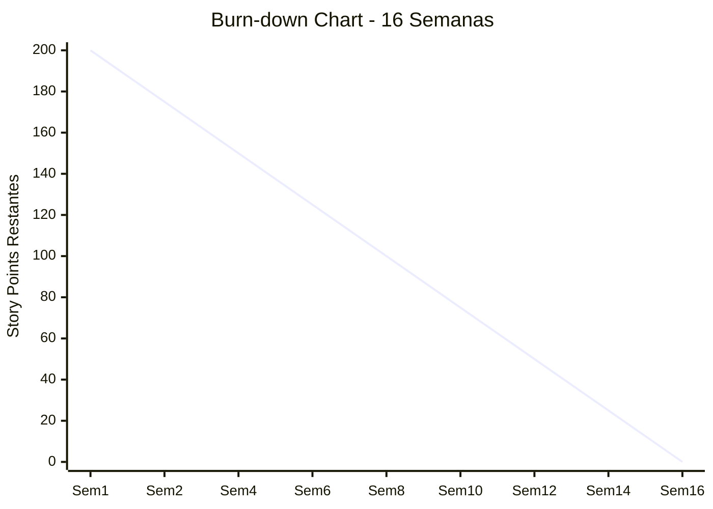

# 🗺️ Roadmap Técnico para Produção - LicitaReview
**Cronograma Detalhado e Dependências**

**Data:** Janeiro 2025  
**Versão:** 1.0  
**Período:** 16 semanas (4 meses)  
**Metodologia:** Lean Inception + Agile

---

## 📅 1. Cronograma Geral



---

## 🔄 2. Onda 1 - MVP Produção (Semanas 1-4)

### 2.1 Semana 1-2: Infraestrutura Base

#### **Sprint 1.1: Setup de Ambientes (Semana 1)**

**Objetivo:** Configurar infraestrutura base para staging e produção

| Tarefa | Responsável | Esforço | Dependências | Status |
|--------|-------------|---------|--------------|--------|
| **Terraform Setup** | DevOps | 3d | - | 🔄 |
| Configurar VPC e redes | DevOps | 2d | Terraform | 🔄 |
| Setup Cloud Run produção | DevOps | 2d | VPC | 🔄 |
| Configurar Firestore produção | DevOps | 1d | - | 🔄 |
| Setup domínios e SSL | DevOps | 2d | DNS config | 🔄 |

**Entregáveis:**
```yaml
# terraform/environments/production/main.tf
resource "google_project" "licitareview_prod" {
  name       = "LicitaReview Production"
  project_id = "licitareview-prod"
}

resource "google_cloud_run_service" "analyzer" {
  name     = "document-analyzer"
  location = "us-central1"
  
  template {
    spec {
      containers {
        image = "gcr.io/licitareview-prod/analyzer:latest"
        resources {
          limits = {
            cpu    = "2000m"
            memory = "4Gi"
          }
        }
      }
    }
  }
}
```

#### **Sprint 1.2: CI/CD Pipeline (Semana 2)**

**Objetivo:** Implementar pipeline completo de deploy

| Tarefa | Responsável | Esforço | Dependências | Status |
|--------|-------------|---------|--------------|--------|
| **GitHub Actions produção** | DevOps | 2d | Terraform | 🔄 |
| Configurar secrets management | DevOps | 1d | GCP setup | 🔄 |
| Implementar deploy canário | DevOps | 3d | Cloud Run | 🔄 |
| Setup rollback automático | DevOps | 2d | Deploy pipeline | 🔄 |
| Testes de smoke automatizados | QA | 2d | Deploy pipeline | 🔄 |

**Entregáveis:**
```yaml
# .github/workflows/deploy-production.yml
name: Deploy to Production
on:
  push:
    branches: [main]
    
jobs:
  deploy-canary:
    runs-on: ubuntu-latest
    steps:
      - name: Deploy Canary (5%)
        run: |
          gcloud run deploy analyzer \
            --image gcr.io/$PROJECT_ID/analyzer:$GITHUB_SHA \
            --platform managed \
            --region us-central1 \
            --traffic latest=5,stable=95
            
      - name: Run Smoke Tests
        run: npm run test:smoke
        
      - name: Monitor Metrics
        run: |
          # Wait 10 minutes and check error rates
          sleep 600
          ERROR_RATE=$(gcloud monitoring metrics list --filter="error_rate > 0.01")
          if [ ! -z "$ERROR_RATE" ]; then
            echo "High error rate detected, rolling back"
            gcloud run deploy analyzer --traffic stable=100
            exit 1
          fi
```

### 2.2 Semana 3: Segurança Essencial

#### **Sprint 1.3: Implementação de Segurança**

**Objetivo:** Implementar requisitos mínimos de segurança para produção

| Tarefa | Responsável | Esforço | Dependências | Status |
|--------|-------------|---------|--------------|--------|
| **HTTPS obrigatório** | Backend | 1d | SSL setup | 🔄 |
| Headers de segurança | Backend | 1d | - | 🔄 |
| Gestão segura de secrets | DevOps | 2d | Secret Manager | 🔄 |
| Auditoria de acesso básica | Backend | 2d | Firestore rules | 🔄 |
| Security headers middleware | Backend | 1d | Express setup | 🔄 |

**Implementação:**
```typescript
// middleware/security.ts
import helmet from 'helmet';
import rateLimit from 'express-rate-limit';

export const securityMiddleware = [
  helmet({
    contentSecurityPolicy: {
      directives: {
        defaultSrc: ["'self'"],
        styleSrc: ["'self'", "'unsafe-inline'"],
        scriptSrc: ["'self'"],
        imgSrc: ["'self'", "data:", "https:"],
      },
    },
    hsts: {
      maxAge: 31536000,
      includeSubDomains: true,
      preload: true
    }
  }),
  
  rateLimit({
    windowMs: 15 * 60 * 1000, // 15 minutes
    max: 100, // limit each IP to 100 requests per windowMs
    message: 'Too many requests from this IP'
  })
];

// Audit logging
export const auditLogger = (req: Request, res: Response, next: NextFunction) => {
  const auditData = {
    timestamp: new Date().toISOString(),
    userId: req.user?.uid,
    action: `${req.method} ${req.path}`,
    ip: req.ip,
    userAgent: req.get('User-Agent')
  };
  
  // Log to Cloud Logging
  console.log(JSON.stringify({ audit: auditData }));
  next();
};
```

### 2.3 Semana 4: Monitoramento e Deploy

#### **Sprint 1.4: Observabilidade**

**Objetivo:** Implementar monitoramento essencial para produção

| Tarefa | Responsável | Esforço | Dependências | Status |
|--------|-------------|---------|--------------|--------|
| **Logging estruturado** | Backend | 2d | - | 🔄 |
| Métricas de sistema | DevOps | 2d | Cloud Monitoring | 🔄 |
| Alertas críticos | DevOps | 1d | Métricas | 🔄 |
| Dashboard operacional | DevOps | 2d | Métricas | 🔄 |
| Health checks avançados | Backend | 1d | - | 🔄 |

**Implementação:**
```typescript
// utils/monitoring.ts
import { createLogger, format, transports } from 'winston';
import { ErrorReporting } from '@google-cloud/error-reporting';

const errorReporting = new ErrorReporting();

export const logger = createLogger({
  format: format.combine(
    format.timestamp(),
    format.errors({ stack: true }),
    format.json()
  ),
  transports: [
    new transports.Console(),
    new transports.File({ filename: 'app.log' })
  ]
});

// Métricas customizadas
export class MetricsCollector {
  private static instance: MetricsCollector;
  
  static getInstance(): MetricsCollector {
    if (!MetricsCollector.instance) {
      MetricsCollector.instance = new MetricsCollector();
    }
    return MetricsCollector.instance;
  }
  
  recordAnalysisTime(duration: number) {
    // Enviar para Cloud Monitoring
    console.log(JSON.stringify({
      metric: 'analysis_duration',
      value: duration,
      timestamp: Date.now()
    }));
  }
  
  recordError(error: Error, context: any) {
    errorReporting.report(error);
    logger.error('Application error', { error: error.message, context });
  }
}
```

---

## 🔍 3. Onda 2 - Validação de Negócio (Semanas 5-8)

### 3.1 Semana 5-6: Pesquisa com Usuários

#### **Sprint 2.1: Preparação da Pesquisa**

**Objetivo:** Validar hipóteses de valor com usuários reais

| Tarefa | Responsável | Esforço | Dependências | Status |
|--------|-------------|---------|--------------|--------|
| **Recrutar usuários** | Product | 3d | - | 🔄 |
| Preparar roteiro entrevistas | Product | 2d | - | 🔄 |
| Setup ferramentas pesquisa | Product | 1d | - | 🔄 |
| Conduzir 15 entrevistas | Product | 5d | Usuários | 🔄 |
| Análise e insights | Product | 2d | Entrevistas | 🔄 |

**Roteiro de Entrevista:**
```markdown
# Roteiro de Validação - LicitaReview

## Perfil do Entrevistado (5 min)
- Cargo e experiência com licitações
- Volume de editais analisados por mês
- Ferramentas atuais utilizadas
- Principais dores no processo atual

## Validação de Valor (15 min)
- Como você analisa editais hoje?
- Quanto tempo gasta em média por edital?
- Quais critérios são mais importantes?
- Como você personaliza a análise por cliente?
- O que mais frustra no processo atual?

## Teste de Conceito (10 min)
- [Demonstrar protótipo dos parâmetros personalizados]
- Qual seria o valor desta funcionalidade?
- Você pagaria por uma solução assim?
- Quanto seria um preço justo?
- O que está faltando?

## Próximos Passos (5 min)
- Interesse em participar do beta?
- Indicações de outros usuários
- Feedback sobre a experiência
```

### 3.2 Semana 7: Feature Flags e A/B Testing

#### **Sprint 2.2: Implementação de Testes**

**Objetivo:** Implementar infraestrutura para testes A/B

| Tarefa | Responsável | Esforço | Dependências | Status |
|--------|-------------|---------|--------------|--------|
| **Implementar feature flags** | Frontend | 2d | - | 🔄 |
| Setup A/B testing framework | Frontend | 2d | Feature flags | 🔄 |
| Configurar experimentos | Product | 1d | Framework | 🔄 |
| Implementar tracking eventos | Frontend | 2d | Analytics | 🔄 |
| Dashboard de experimentos | Frontend | 1d | Tracking | 🔄 |

**Implementação:**
```typescript
// utils/featureFlags.ts
interface FeatureFlags {
  customParameters: boolean;
  advancedReports: boolean;
  aiSuggestions: boolean;
}

export class FeatureFlagService {
  private flags: FeatureFlags;
  
  constructor(userId: string) {
    this.flags = this.loadFlags(userId);
  }
  
  private loadFlags(userId: string): FeatureFlags {
    // Implementar lógica de segmentação
    const userSegment = this.getUserSegment(userId);
    
    return {
      customParameters: userSegment === 'test_group_a',
      advancedReports: true,
      aiSuggestions: false
    };
  }
  
  isEnabled(flag: keyof FeatureFlags): boolean {
    return this.flags[flag];
  }
}

// Componente React com A/B testing
export const ParameterCustomization: React.FC = () => {
  const featureFlags = useFeatureFlags();
  const analytics = useAnalytics();
  
  useEffect(() => {
    analytics.track('parameter_customization_viewed', {
      variant: featureFlags.isEnabled('customParameters') ? 'A' : 'B'
    });
  }, []);
  
  if (featureFlags.isEnabled('customParameters')) {
    return <AdvancedParameterForm />;
  }
  
  return <BasicParameterForm />;
};
```

### 3.3 Semana 8: Analytics e Feedback

#### **Sprint 2.3: Métricas de Negócio**

**Objetivo:** Implementar tracking completo de métricas de negócio

| Tarefa | Responsável | Esforço | Dependências | Status |
|--------|-------------|---------|--------------|--------|
| **Implementar analytics** | Frontend | 2d | - | 🔄 |
| Dashboard métricas negócio | Frontend | 2d | Analytics | 🔄 |
| Sistema feedback in-app | Frontend | 2d | - | 🔄 |
| Relatórios automatizados | Backend | 1d | Analytics | 🔄 |
| Alertas de métricas | DevOps | 1d | Dashboard | 🔄 |

---

## ⚡ 4. Onda 3 - Otimização (Semanas 9-12)

### 4.1 Semana 9-10: Cache e Performance

#### **Sprint 3.1: Cache Distribuído**

**Objetivo:** Implementar cache para melhorar performance

| Tarefa | Responsável | Esforço | Dependências | Status |
|--------|-------------|---------|--------------|--------|
| **Setup Redis Cloud** | DevOps | 1d | - | 🔄 |
| Implementar cache layer | Backend | 3d | Redis | 🔄 |
| Cache de análises | Backend | 2d | Cache layer | 🔄 |
| Cache de parâmetros | Backend | 1d | Cache layer | 🔄 |
| Monitoramento cache | DevOps | 1d | Redis setup | 🔄 |

**Implementação:**
```typescript
// services/cache.ts
import Redis from 'ioredis';

export class CacheService {
  private redis: Redis;
  
  constructor() {
    this.redis = new Redis({
      host: process.env.REDIS_HOST,
      port: parseInt(process.env.REDIS_PORT || '6379'),
      password: process.env.REDIS_PASSWORD,
      retryDelayOnFailover: 100,
      maxRetriesPerRequest: 3
    });
  }
  
  async cacheAnalysis(documentId: string, analysis: any, ttl = 3600) {
    const key = `analysis:${documentId}`;
    await this.redis.setex(key, ttl, JSON.stringify(analysis));
  }
  
  async getCachedAnalysis(documentId: string) {
    const key = `analysis:${documentId}`;
    const cached = await this.redis.get(key);
    return cached ? JSON.parse(cached) : null;
  }
  
  async invalidateAnalysis(documentId: string) {
    const key = `analysis:${documentId}`;
    await this.redis.del(key);
  }
}

// Middleware de cache
export const cacheMiddleware = (ttl = 300) => {
  return async (req: Request, res: Response, next: NextFunction) => {
    const cacheKey = `${req.method}:${req.originalUrl}`;
    const cached = await cacheService.get(cacheKey);
    
    if (cached) {
      return res.json(JSON.parse(cached));
    }
    
    const originalSend = res.json;
    res.json = function(data) {
      cacheService.set(cacheKey, JSON.stringify(data), ttl);
      return originalSend.call(this, data);
    };
    
    next();
  };
};
```

### 4.2 Semana 11: Auto-scaling e Otimização

#### **Sprint 3.2: Escalabilidade**

**Objetivo:** Configurar auto-scaling e otimizar performance

| Tarefa | Responsável | Esforço | Dependências | Status |
|--------|-------------|---------|--------------|--------|
| **Configurar auto-scaling** | DevOps | 2d | Cloud Run | 🔄 |
| Otimizar queries Firestore | Backend | 2d | - | 🔄 |
| Implementar connection pooling | Backend | 1d | - | 🔄 |
| Otimizar bundle frontend | Frontend | 2d | - | 🔄 |
| Testes de carga | QA | 2d | Auto-scaling | 🔄 |

### 4.3 Semana 12: Backup e Disaster Recovery

#### **Sprint 3.3: Resiliência**

**Objetivo:** Implementar backup e disaster recovery

| Tarefa | Responsável | Esforço | Dependências | Status |
|--------|-------------|---------|--------------|--------|
| **Backup automatizado Firestore** | DevOps | 2d | - | 🔄 |
| Backup de arquivos Cloud Storage | DevOps | 1d | - | 🔄 |
| Plano de disaster recovery | DevOps | 2d | Backups | 🔄 |
| Testes de recuperação | DevOps | 2d | DR plan | 🔄 |
| Documentação operacional | DevOps | 1d | Testes | 🔄 |

---

## 🚀 5. Onda 4 - Funcionalidades Avançadas (Semanas 13-16)

### 5.1 Semana 13-15: IA Generativa

#### **Sprint 4.1: Integração IA**

**Objetivo:** Implementar funcionalidades de IA generativa

| Tarefa | Responsável | Esforço | Dependências | Status |
|--------|-------------|---------|--------------|--------|
| **Integração OpenAI/Gemini** | Backend | 3d | - | 🔄 |
| Geração de resumos automáticos | Backend | 3d | IA integration | 🔄 |
| Sugestões de parâmetros | Backend | 2d | IA integration | 🔄 |
| Interface chat para análise | Frontend | 3d | Backend IA | 🔄 |
| Testes de qualidade IA | QA | 2d | Interface | 🔄 |

### 5.2 Semana 16: API Pública

#### **Sprint 4.2: API Externa**

**Objetivo:** Disponibilizar API pública para integrações

| Tarefa | Responsável | Esforço | Dependências | Status |
|--------|-------------|---------|--------------|--------|
| **Documentação API** | Backend | 2d | - | 🔄 |
| Sistema de API keys | Backend | 2d | - | 🔄 |
| Rate limiting por cliente | Backend | 1d | API keys | 🔄 |
| SDK JavaScript | Frontend | 2d | API | 🔄 |
| Portal do desenvolvedor | Frontend | 1d | SDK | 🔄 |

---

## 📊 6. Métricas de Acompanhamento

### 6.1 Métricas por Sprint

| Sprint | Métrica Principal | Meta | Atual | Status |
|--------|------------------|------|-------|--------|
| 1.1 | Infraestrutura funcional | 100% | 0% | 🔄 |
| 1.2 | Deploy automatizado | 100% | 0% | 🔄 |
| 1.3 | Security score | >90% | 0% | 🔄 |
| 1.4 | Uptime monitoring | 99.9% | 0% | 🔄 |
| 2.1 | Entrevistas realizadas | 15 | 0 | 🔄 |
| 2.2 | Feature flags ativos | 3 | 0 | 🔄 |
| 2.3 | Eventos trackados | >10 | 0 | 🔄 |
| 3.1 | Cache hit rate | >80% | 0% | 🔄 |
| 3.2 | Response time P95 | <500ms | 0ms | 🔄 |
| 3.3 | Backup success rate | 100% | 0% | 🔄 |

### 6.2 Velocity Tracking



### 6.3 Burn-down Chart



---

## 🎯 7. Critérios de Sucesso

### 7.1 Definition of Done por Onda

#### **Onda 1 - MVP Produção**
- [ ] Infraestrutura provisionada via IaC
- [ ] Pipeline CI/CD funcionando
- [ ] Deploy canário implementado
- [ ] Monitoramento básico ativo
- [ ] Security scan passando
- [ ] Testes automatizados >80% coverage
- [ ] Documentação técnica completa

#### **Onda 2 - Validação**
- [ ] 15 entrevistas realizadas
- [ ] Insights documentados
- [ ] Feature flags implementados
- [ ] 3 experimentos A/B ativos
- [ ] Métricas de negócio trackadas
- [ ] Dashboard de analytics funcionando

#### **Onda 3 - Otimização**
- [ ] Cache implementado (>80% hit rate)
- [ ] Performance otimizada (<500ms P95)
- [ ] Auto-scaling configurado
- [ ] Backup automatizado funcionando
- [ ] Testes de carga passando
- [ ] DR plan testado

#### **Onda 4 - Avançado**
- [ ] IA generativa integrada
- [ ] API pública documentada
- [ ] SDK disponível
- [ ] Portal do desenvolvedor ativo
- [ ] Integrações testadas

### 7.2 Critérios de Go-Live

#### **Técnicos**
- ✅ Todos os testes passando
- ✅ Security audit aprovado
- ✅ Performance dentro dos SLAs
- ✅ Monitoramento completo
- ✅ Backup e DR testados

#### **Negócio**
- ✅ Validação de valor confirmada
- ✅ Métricas de sucesso definidas
- ✅ Suporte configurado
- ✅ Documentação de usuário
- ✅ Go-to-market aprovado

---

## 🚨 8. Riscos e Contingências

### 8.1 Riscos Técnicos

| Risco | Probabilidade | Impacto | Mitigação | Contingência |
|-------|---------------|---------|-----------|-------------|
| **Problemas de performance** | Média | Alto | Testes de carga obrigatórios | Otimização emergencial |
| **Falhas de segurança** | Baixa | Crítico | Security audit externo | Rollback imediato |
| **Instabilidade Cloud Run** | Baixa | Médio | Monitoramento proativo | Fallback para Functions |
| **Problemas de integração** | Média | Médio | Testes de integração | Implementação manual |

### 8.2 Riscos de Negócio

| Risco | Probabilidade | Impacto | Mitigação | Contingência |
|-------|---------------|---------|-----------|-------------|
| **Hipótese de valor incorreta** | Alta | Crítico | Pesquisa intensiva | Pivot de funcionalidades |
| **Concorrência agressiva** | Média | Alto | Diferenciação clara | Aceleração do roadmap |
| **Mudanças regulatórias** | Baixa | Alto | Monitoramento legal | Adaptação rápida |
| **Problemas de adoção** | Média | Alto | UX research contínuo | Simplificação do produto |

### 8.3 Planos de Contingência

#### **Atraso no Cronograma**
- **Trigger:** >20% de atraso em qualquer onda
- **Ação:** Repriorizar funcionalidades, adicionar recursos
- **Escalação:** Tech Lead → CTO → CEO

#### **Problemas de Performance**
- **Trigger:** P95 latency >1000ms
- **Ação:** Otimização emergencial, cache agressivo
- **Escalação:** DevOps → Tech Lead → Arquiteto

#### **Falhas de Segurança**
- **Trigger:** Vulnerabilidade crítica detectada
- **Ação:** Rollback imediato, patch emergencial
- **Escalação:** Security → Tech Lead → CTO

---

## 📋 9. Checklist de Entrega

### 9.1 Checklist Técnico

#### **Infraestrutura**
- [ ] Terraform configurado
- [ ] Ambientes staging/produção
- [ ] Monitoramento ativo
- [ ] Backup automatizado
- [ ] SSL/TLS configurado

#### **Aplicação**
- [ ] Frontend otimizado
- [ ] Backend escalável
- [ ] APIs documentadas
- [ ] Testes automatizados
- [ ] Performance otimizada

#### **Segurança**
- [ ] Autenticação robusta
- [ ] Autorização granular
- [ ] Auditoria de acesso
- [ ] Criptografia de dados
- [ ] Security headers

### 9.2 Checklist de Negócio

#### **Validação**
- [ ] Pesquisa com usuários
- [ ] Hipóteses validadas
- [ ] Métricas definidas
- [ ] Feedback coletado
- [ ] Insights documentados

#### **Operação**
- [ ] Suporte configurado
- [ ] Documentação completa
- [ ] Treinamento realizado
- [ ] Processos definidos
- [ ] SLAs estabelecidos

---

**Roadmap preparado seguindo metodologia Lean Inception**  
**Próxima atualização:** Semanal durante execução  
**Responsável:** Tech Lead + Product Manager  
**Status:** ✅ Pronto para Execução