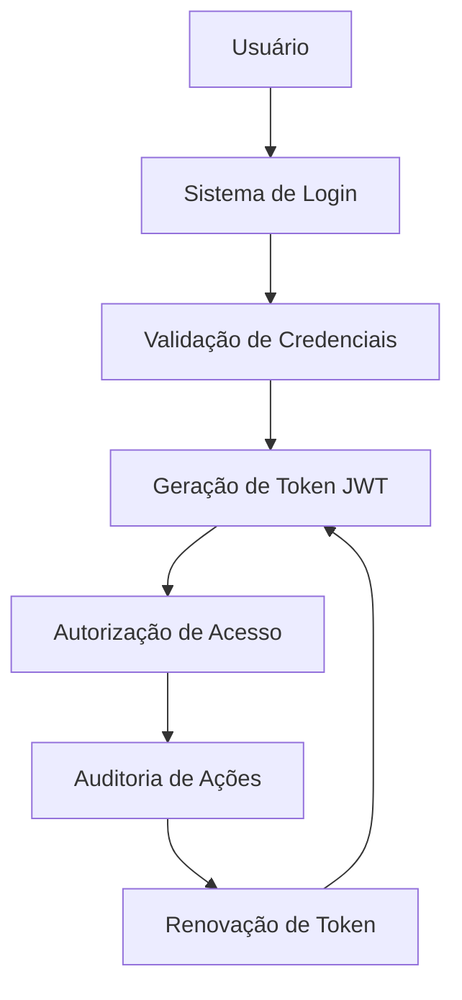
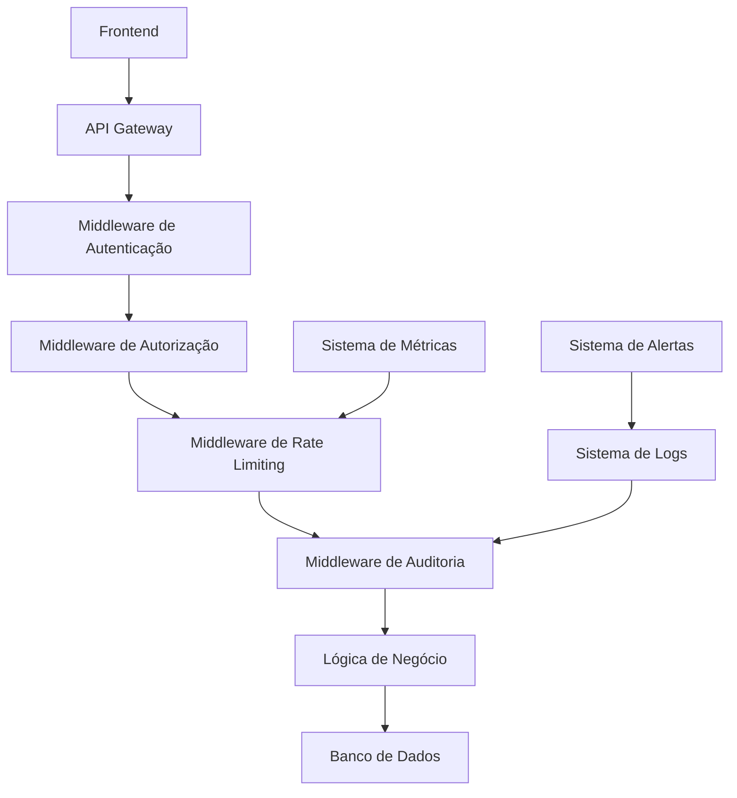

# Guia de Lean Inception para Desenvolvimento de Apps
## Documentação Metodológica para Sistemas de IA

---

## 1. INTRODUÇÃO À LEAN INCEPTION

### 1.1 Conceito Fundamental
A Lean Inception é uma metodologia ágil que visa identificar e definir projetos de forma enxuta, rápida e eficiente através de um **workshop colaborativo** focado na criação de um **Produto Mínimo Viável (MVP)**.

### 1.2 Objetivo Principal
- Definir o escopo do produto de forma clara
- Criar um plano estratégico para o MVP
- Alinhar expectativas da equipe
- Validar hipóteses de negócio rapidamente
- Minimizar desperdícios de tempo e recursos

---

## 2. CARACTERÍSTICAS DO MVP (PRODUTO MÍNIMO VIÁVEL)

### 2.1 Definição
O MVP é a versão mais simples de um produto que pode ser:
- **Criado** com mínimo esforço
- **Usado** pelos usuários finais
- **Validado** no mercado
- **Evoluído** baseado em feedback real

### 2.2 Pilares Fundamentais do MVP
O MVP deve ser a interseção de:

#### **VALIOSO** 💰
- Gera retorno sobre investimento
- Atende necessidade real do usuário
- Tem potencial comercial

#### **USÁVEL** 👥
- Interface intuitiva e funcional
- Experiência do usuário satisfatória
- Facilita realização de tarefas

#### **FACTÍVEL** ⚙️
- Tecnicamente possível de implementar
- Recursos e conhecimento disponíveis
- Prazo realista de desenvolvimento

#### **FATOR "UAU"** ✨
- Diferencial competitivo
- Encanta e fideliza usuários
- Gera recomendação orgânica

---

## 3. PROCESSO ESTRUTURADO DA LEAN INCEPTION

### 3.1 Sequência de Atividades (Workshop de 5 dias)

#### **DIA 1: VISÃO E PRODUTO**
1. **Visão do Produto**
   - Definir propósito e objetivos
   - Responder: "Para quem?", "Por quê?", "O quê?"

2. **É/Não É/Faz/Não Faz**
   - Esclarecer limites e funcionalidades
   - Reduzir ambiguidades

#### **DIA 2: USUÁRIOS E FUNCIONALIDADES**
3. **Personas**
   - Perfis detalhados dos usuários
   - Necessidades e comportamentos

4. **Brainstorming de Funcionalidades**
   - Ideação colaborativa
   - Mapear todas as possibilidades

#### **DIA 3: PRIORIZAÇÃO**
5. **Revisão Técnica, UX e Negócio**
   - Avaliar: Esforço, Valor UX, Valor Negócio, Confiança
   - Classificar em escala 1-3

6. **Jornada do Usuário**
   - Mapear fluxo de interação
   - Integrar funcionalidades ao contexto

#### **DIA 4: PLANEJAMENTO**
7. **Sequenciador**
   - Priorizar funcionalidades em "ondas"
   - Definir MVP e incrementos

8. **Canvas MVP**
   - Visão consolidada do produto mínimo

#### **DIA 5: VALIDAÇÃO**
9. **Estimativas de Tempo, Esforço e Custo**
   - Dimensionamento técnico
   - Planejamento de recursos

---

## 4. TEMPLATES E FRAMEWORKS

### 4.1 Template de Visão do Produto
```
Para [PÚBLICO-ALVO]
Cujo [PROBLEMA/NECESSIDADE]
O [NOME DO PRODUTO]
É um [CATEGORIA DO PRODUTO]
Que [BENEFÍCIO PRINCIPAL]
Diferentemente de [CONCORRENTE/SOLUÇÃO ATUAL]
O nosso produto [DIFERENCIAL ÚNICO]
```

### 4.2 Canvas MVP - 7 Blocos Essenciais

#### 1. **Proposta do MVP**
- Qual é o valor central oferecido?

#### 2. **Personas Segmentadas**
- Para quem especificamente?

#### 3. **Jornadas**
- Quais fluxos de uso são atendidos?

#### 4. **Funcionalidades**
- O que será construído?

#### 5. **Resultado Esperado**
- Que aprendizado queremos obter?

#### 6. **Métricas**
- Como medir sucesso/falha?

#### 7. **Custo e Cronograma**
- Investimento e prazo necessários?

### 4.3 Matriz de Avaliação de Funcionalidades

| Funcionalidade | Esforço (E/EE/EEE) | Valor Negócio ($/$$/$$$) | Valor UX (♥/♥♥/♥♥♥) | Confiança (🔴/🟡/🟢) |
|---------------|-------------------|-------------------------|-------------------|-------------------|
| Feature A     | E                 | $$$                     | ♥♥♥               | 🟢                |
| Feature B     | EEE               | $$                      | ♥♥                | 🟡                |

---

## 5. REGRAS DO SEQUENCIADOR

### 5.1 Regras por Onda de Desenvolvimento
- **Máximo**: 3 funcionalidades por onda
- **Esforço**: Soma ≤ 5 "E"
- **Valor**: Mínimo 4 "$" e 4 "♥"
- **Risco**: Máximo 1 item vermelho (🔴)
- **Equilíbrio**: Não pode ter apenas itens amarelos/vermelhos
- **Dependência**: Pré-requisitos em ondas anteriores

### 5.2 Identificação do MVP
- Primeira onda que entrega **valor mínimo viável**
- Pode validar **hipótese de negócio**
- Usuários conseguem **completar jornada básica**

---

## 6. PROCESSO DE ESTIMATIVA

### 6.1 Técnica de Dimensionamento (T-shirt Sizing)
- **P (Pequeno)**: 1-2 dias de desenvolvimento
- **M (Médio)**: 3-5 dias de desenvolvimento  
- **G (Grande)**: 6-10 dias de desenvolvimento

### 6.2 Cálculo de Esforço
1. Detalhar funcionalidades em tarefas
2. Dimensionar cada tarefa (P/M/G)
3. Estimar tempo por pessoa
4. Calcular esforço total da onda
5. Usar média para projetar outras ondas

---

## 7. CASOS DE SUCESSO - REFERÊNCIAS

### 7.1 Exemplos de MVPs Famosos
- **Dropbox**: Vídeo demonstrativo antes do produto
- **Airbnb**: Aluguel do próprio apartamento
- **Instagram**: Apenas compartilhar fotos com filtros
- **Facebook**: Rede social apenas para Harvard
- **Spotify**: Streaming básico de música

### 7.2 Padrão de Evolução MVP
```
MVP1 → Feedback → Ajustes → MVP2 → Feedback → Produto Final
```

---

## 8. IMPLEMENTAÇÃO PARA IA DE DESENVOLVIMENTO

### 8.1 Inputs Necessários para a IA
```json
{
  "projeto": {
    "nome": "string",
    "categoria": "mobile_app|web_app|desktop|api",
    "publico_alvo": "string",
    "problema": "string",
    "objetivos": ["string"]
  },
  "personas": [{
    "nome": "string",
    "perfil": "string", 
    "necessidades": ["string"],
    "comportamentos": ["string"]
  }],
  "funcionalidades": [{
    "nome": "string",
    "descricao": "string",
    "esforco": "P|M|G",
    "valor_negocio": 1-3,
    "valor_ux": 1-3,
    "confianca": "baixa|media|alta"
  }],
  "restricoes": {
    "tempo": "string",
    "orcamento": "string", 
    "tecnologias": ["string"]
  }
}
```

### 8.2 Outputs da IA
```json
{
  "mvp_definido": {
    "proposta": "string",
    "personas_priorizadas": ["string"],
    "jornadas_principais": ["string"],
    "funcionalidades_mvp": ["string"],
    "metricas": ["string"],
    "cronograma": "string",
    "estimativa_custo": "string"
  },
  "roadmap": {
    "onda_1_mvp": ["funcionalidade"],
    "onda_2": ["funcionalidade"],
    "onda_3": ["funcionalidade"]
  },
  "arquitetura_sugerida": {
    "tecnologias": ["string"],
    "estrutura": "string",
    "integrações": ["string"]
  }
}
```

### 8.3 Processo de Validação da IA
1. **Verificar alinhamento** com pilares do MVP
2. **Validar sequenciamento** de funcionalidades
3. **Confirmar viabilidade** técnica
4. **Estimar recursos** necessários
5. **Sugerir métricas** de validação

---

## 9. DIRETRIZES PARA DESENVOLVIMENTO ÁGIL

### 9.1 Princípios Fundamentais
- **Iteração rápida** sobre planejamento extenso
- **Feedback real** sobre especulações
- **Produto funcional** sobre documentação
- **Colaboração** sobre processos rígidos

### 9.2 Critérios de Pronto (Definition of Done)
- Funcionalidade testada e funcionando
- Interface responsiva e usável
- Integração com outros módulos
- Métricas de acompanhamento implementadas
- Documentação básica criada

### 9.3 Ciclo de Validação
```
Construir → Medir → Aprender → Decidir → Construir
```

---

## 10. FERRAMENTAS E RECURSOS

### 10.1 Ferramentas Digitais Recomendadas
- **Colaboração**: Miro, Figma, Jamboard
- **Prototipagem**: Figma, Adobe XD, Sketch
- **Desenvolvimento**: GitHub, GitLab
- **Monitoramento**: Google Analytics, Mixpanel
- **Comunicação**: Slack, Discord, Teams

### 10.2 Checklist de Implementação
- [ ] Visão do produto definida
- [ ] Personas identificadas
- [ ] Funcionalidades priorizadas
- [ ] MVP sequenciado
- [ ] Estimativas realizadas
- [ ] Métricas definidas
- [ ] Equipe alinhada
- [ ] Recursos disponíveis

---

## 11. IMPLEMENTAÇÃO DE SEGURANÇA E AUTENTICAÇÃO EM MVPs

### 11.1 Segurança como Funcionalidade Crítica

A segurança não deve ser considerada uma funcionalidade opcional ou "para depois" em um MVP. Ela é um **requisito fundamental** que deve ser incorporado desde o primeiro dia de desenvolvimento.

#### **Por que Segurança é Crítica no MVP?**
- **Confiança do Usuário**: Usuários não adotam produtos que não transmitem segurança
- **Conformidade Legal**: LGPD, GDPR e outras regulamentações exigem proteção desde o início
- **Custo de Correção**: Implementar segurança depois é 10x mais caro que desde o início
- **Reputação**: Vazamentos de dados podem destruir a credibilidade do produto

### 11.2 Autenticação como Pilar do MVP

#### **Componentes Essenciais de Autenticação**


#### **Funcionalidades Mínimas de Autenticação**
| Funcionalidade | Prioridade | Esforço | Justificativa |
|---------------|------------|---------|---------------|
| Login/Logout | 🔴 Crítica | M | Base para identificação do usuário |
| Validação JWT | 🔴 Crítica | M | Segurança de sessão |
| Refresh Tokens | 🟡 Alta | G | Experiência contínua do usuário |
| Recuperação de Senha | 🟡 Alta | M | Reduz abandono por senha esquecida |
| Auditoria de Login | 🟢 Média | P | Monitoramento de segurança |
| 2FA (Autenticação Dupla) | 🟢 Média | G | Segurança adicional para dados sensíveis |

### 11.3 Métricas de Segurança para Validação do MVP

#### **Métricas Técnicas**
- **Taxa de Falha de Autenticação**: < 1% de falhas não relacionadas a credenciais incorretas
- **Tempo de Validação de Token**: < 100ms para validação JWT
- **Cobertura de Testes de Segurança**: > 85% do código de autenticação
- **Vulnerabilidades Conhecidas**: 0 vulnerabilidades críticas ou altas

#### **Métricas de Usuário**
- **Taxa de Abandono no Login**: < 15% dos usuários que iniciam o processo
- **Tempo Médio de Login**: < 30 segundos do início ao acesso
- **Satisfação com Segurança**: > 4.0/5.0 em pesquisas de usuário
- **Incidentes de Segurança Reportados**: 0 por mês

### 11.4 Boas Práticas de Implementação Segura

#### **Princípios de Segurança por Design**
1. **Princípio do Menor Privilégio**: Usuários têm apenas as permissões mínimas necessárias
2. **Defesa em Profundidade**: Múltiplas camadas de segurança (autenticação, autorização, auditoria)
3. **Falha Segura**: Em caso de erro, o sistema deve negar acesso por padrão
4. **Transparência**: Logs detalhados para auditoria sem expor dados sensíveis

#### **Checklist de Segurança para MVP**
- [ ] **Autenticação Implementada**: Sistema de login funcional e seguro
- [ ] **Tokens JWT**: Geração, validação e renovação de tokens
- [ ] **HTTPS Obrigatório**: Toda comunicação criptografada
- [ ] **Validação de Entrada**: Sanitização de todos os inputs do usuário
- [ ] **Rate Limiting**: Proteção contra ataques de força bruta
- [ ] **CORS Configurado**: Controle de origem das requisições
- [ ] **Headers de Segurança**: CSP, HSTS, X-Frame-Options implementados
- [ ] **Auditoria Básica**: Log de ações críticas do usuário
- [ ] **Backup Seguro**: Dados protegidos e recuperáveis
- [ ] **Testes de Penetração**: Validação básica de segurança

#### **Arquitetura de Segurança Recomendada**


### 11.5 Integração com o Processo Lean Inception

#### **Durante o Workshop de 5 Dias**
- **Dia 1**: Incluir "segurança" como requisito não-funcional na visão do produto
- **Dia 2**: Criar persona "Administrador de Segurança" se aplicável
- **Dia 3**: Priorizar funcionalidades de segurança como "valor de negócio alto"
- **Dia 4**: Incluir autenticação na primeira onda (MVP)
- **Dia 5**: Estimar tempo adicional para implementação segura (+20-30%)

#### **Validação de Hipóteses de Segurança**
- **Hipótese**: "Usuários confiam em um sistema com login seguro"
- **Métrica**: Taxa de conversão de visitantes para usuários registrados
- **Experimento**: A/B test com diferentes níveis de indicadores de segurança
- **Critério de Sucesso**: > 25% de conversão com indicadores de segurança visíveis

---

## 12. CONCLUSÃO

A Lean Inception fornece um framework estruturado para transformar ideias em produtos viáveis através de um processo colaborativo e orientado por dados. Para sistemas de IA que desenvolvem aplicações, esta metodologia oferece:

- **Redução de riscos** através de validação precoce
- **Otimização de recursos** focando no essencial
- **Alinhamento de expectativas** entre stakeholders
- **Base sólida** para desenvolvimento iterativo
- **Métricas claras** para avaliação de sucesso
- **Segurança integrada** desde o primeiro dia

O MVP não é um produto incompleto, mas sim a **versão mais inteligente** de iniciar um projeto, maximizando aprendizado e minimizando desperdícios, sempre com segurança como prioridade fundamental.